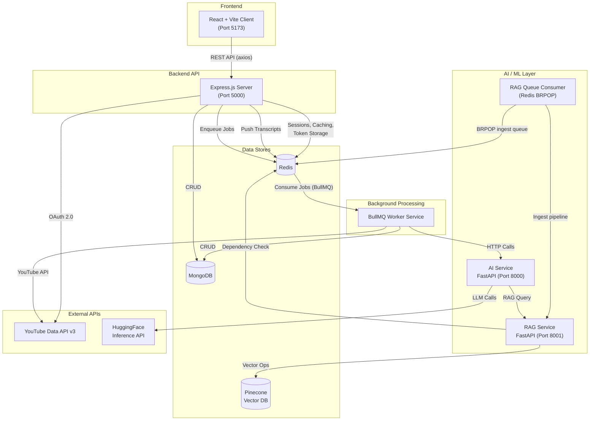
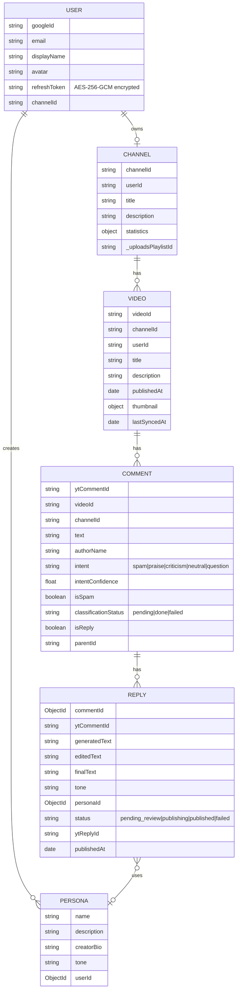
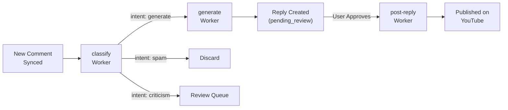
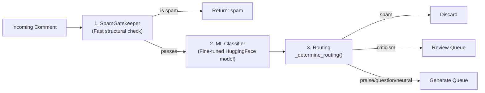
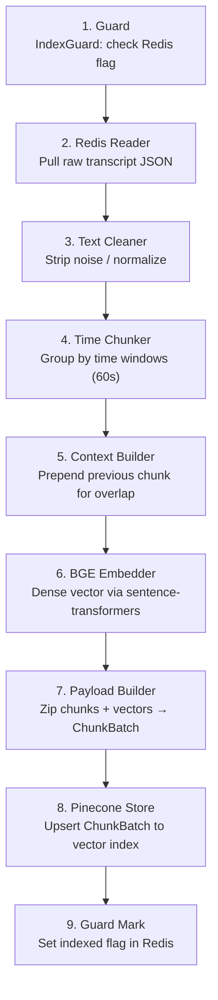
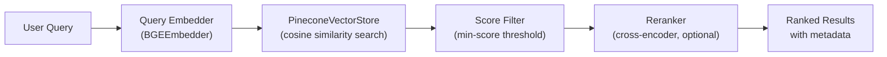
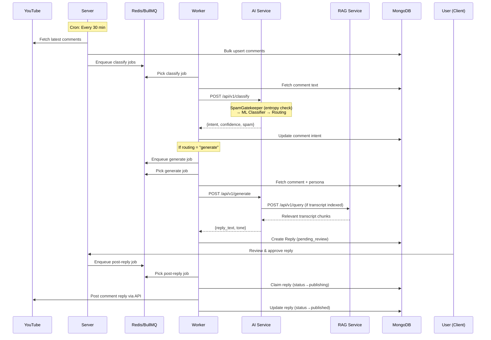
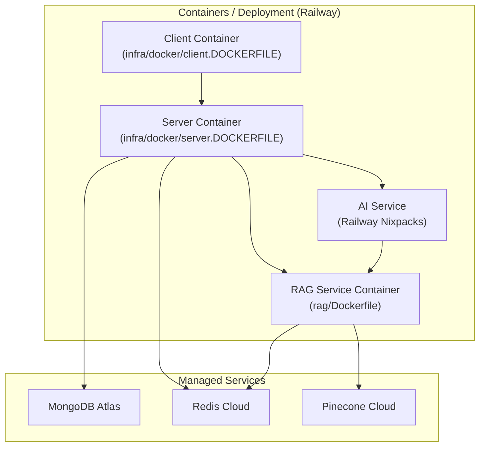

# ReplyPilot — System Architecture

## 1. Project Overview

**ReplyPilot** is an AI-powered YouTube comment management platform that automates comment classification, reply generation, and publishing. It uses a **microservices architecture** with 5 independent services communicating via REST APIs and Redis-backed message queues.

---

## 2. High-Level Architecture Diagram



### System Components Interaction:
- **Client**: The React frontend where users manage their YouTube channels and AI personas.
- **Server**: The Express backend acts as the main HTTP API gateway. It handles Google OAuth, fetches data from the YouTube API, securely stores encrypted tokens, and delegates heavy tasks to the message queue.
- **Worker (BullMQ)**: A standalone Node.js process that constantly polls Redis-backed queues. It fetches tasks like classifying new comments, generating AI replies, or publishing approved replies back to YouTube.
- **AI Service (FastAPI)**: A specialized Python microservice equipped with custom ML models and LLMs. It classifies the intent of comments (e.g., whether it's spam or praise) and generates drafted replies based on user-selected personas. Conditionally calls RAG for transcript-aware context enrichment.
- **RAG Service (FastAPI)**: Analyzes video transcripts and stores them as vectors in Pinecone, enabling the AI Service to look up contextual information from the original video when answering comments.
- **RAG Queue Consumer**: A long-running, in-process `QueueConsumer` (Redis BRPOP) that handles asynchronous transcript ingestion jobs without blocking the HTTP API — it recovers stalled jobs on startup.

---

## 3. Service Breakdown

### 3.1 Client — React + Vite Frontend

| Aspect | Detail |
|--------|--------|
| **Framework** | React 18 + Vite |
| **Routing** | React Router v6 with `ProtectedRoute` guard |
| **State** | `AuthContext` for auth state, `useAuth` hook |
| **API Layer** | Axios with base config (`api/axios.js`) |

#### Pages

| Page | Route | Purpose |
|------|-------|---------|
| `LandingPage` | `/` | Public marketing/login page |
| `DashboardPage` | `/dashboard` | Channel overview & analytics |
| `VideosPage` | `/videos` | List all synced videos |
| `VideoDetailPage` | `/videos/:videoId` | Video details + comments |
| `RepliesPage` | `/replies` | Manage AI-generated replies |
| `PersonasPage` | `/personas` | Create/manage reply personas |

#### Key Components

| Component | Purpose |
|-----------|---------|
| `VideoCard` | Video thumbnail + metadata display with formatted timestamps |
| `VideoInfoBar` | Video-level stats and metadata bar |
| `CommentCard` | Comment display with classification badge and reply actions |
| `AppLayout` | Persistent navigation shell wrapping all authenticated pages |
| `ProtectedRoute` | Route guard — redirects unauthenticated users to `/` |

#### API Modules
`channel.js`, `comments.js`, `replies.js`, `personas.js` — mapped to server REST endpoints.

---

### 3.2 Server — Express.js Backend API

| Aspect | Detail |
|--------|--------|
| **Framework** | Express.js (ES Modules) |
| **Port** | 5000 |
| **Auth** | Google OAuth 2.0 via Passport.js |
| **Sessions** | Redis-backed (`connect-redis`) with 7-day TTL |
| **Security** | Helmet, CORS, CSRF protection, rate limiting |
| **Logging** | Winston logger |

#### Architecture Pattern: MVC + Service Layer

```
Routes → Controllers → Services → Models (MongoDB)
                          ↓
                    Queue Service (BullMQ)
```

#### API Routes

| Route Prefix | Resource | Key Operations |
|-------------|----------|----------------|
| `/api/auth` | Authentication | Google OAuth login/callback, session, CSRF token |
| `/api/channel` | Channel | Sync channel info, fetch videos, fetch comments |
| `/api/comments` | Comments | List/filter comments, classification status, manual intent update |
| `/api/personas` | Personas | CRUD for reply persona profiles, AI-assisted persona analysis |
| `/api/batch` | Batch Ops | Bulk classify/generate for multiple comments |
| `/api/replies` | Replies | List, approve, edit, create manually, delete, post replies |
| `/health` | Health Check | Service liveness probe |

#### Middleware Stack

| Middleware | Purpose |
|-----------|---------|
| `auth.middleware.js` | Session-based authentication check |
| `csrf.middleware.js` | CSRF token validation on state-changing routes |
| `rateLimiter.middleware.js` | API rate limiting (Redis-backed) |
| `youtubeToken.middleware.js` | Injects valid YouTube access token into `req` (auto-refresh) |
| `requestLogger.middleware.js` | Structured HTTP request logging |
| `error.middleware.js` | Global error handler — converts all errors to JSON responses |

#### Data Models (MongoDB / Mongoose)



#### Key Services

| Service | Responsibility |
|---------|---------------|
| `Channel.service.js` | Sync channel, videos, comments from YouTube API; bulk upsert to MongoDB |
| `queue.service.js` | BullMQ queue initialization (classify, generate, post-reply); enqueue helpers |
| `replyService.js` | HTTP calls to AI Service for reply generation |
| `aiService.js` | HTTP calls to AI Service for intent classification |

#### Background Jobs

| Job | Schedule | Purpose |
|-----|----------|---------|
| `syncComments.job.js` | Every 30 min (cron) | Fetches latest comments for all videos across all channels |

#### Security Features

- **Token Encryption**: Google refresh tokens encrypted at rest with AES-256-GCM (`utils/crypto.js`)
- **User Caching**: Redis cache for deserialized user (15-min TTL, avoids DB hit per request)
- **YouTube Token Management**: Access tokens cached in Redis (55-min TTL), auto-refresh via refresh token (`youtubeToken.helper.js`)
- **Session Regeneration**: On OAuth callback
- **Graceful Shutdown**: SIGTERM/SIGINT handlers for server, cron, DB

---

### 3.3 Worker — BullMQ Background Job Processor

| Aspect | Detail |
|--------|--------|
| **Queue System** | BullMQ on Redis |
| **Concurrency** | 5 per worker |
| **Retry Policy** | 3 attempts, exponential backoff (5s base) |
| **Separate Process** | Runs independently from API server |

#### Worker Pipeline



#### Workers Detail

| Worker | Queue Name | What It Does |
|--------|-----------|-------------|
| `classify.worker.js` | `classify` | Fetches comment → calls AI `/api/v1/classify` → updates intent, spam status |
| `generate.worker.js` | `generate` | Fetches comment + persona → calls AI `/api/v1/generate` → creates `Reply` doc; fetches few-shot examples via `fetchFewShotExamples()` |
| `postReply.worker.js` | `post-reply` | Claims reply → gets YouTube token → posts via YouTube API → marks published |
| `youtubeSync.worker.js` | `youtube-sync-queue` | Syncs latest videos (24h) + caches transcripts in Redis |

#### Scheduler

| Component | Purpose |
|-----------|---------|
| `scheduler.js` | BullMQ repeatable job — runs daily at midnight, dispatches `youtube-sync` jobs for all users |

#### Post-Reply Idempotency
- Atomic claim via `findOneAndUpdate` with status guard
- YouTube reply ID checkpointed immediately after post
- `replyCountCredited` flag prevents double-counting on retries

---

### 3.4 AI Service — FastAPI (Python)

| Aspect | Detail |
|--------|--------|
| **Framework** | FastAPI |
| **Port** | 8000 |
| **Endpoints** | `/api/v1/classify`, `/api/v1/classify/batch`, `/api/v1/generate`, `/api/v1/generate/batch` |
| **Config** | Pydantic `Settings` with cached singleton via `get_settings()` |
| **Logging** | Structured JSON (loguru) — one JSON object per log line |

#### Intent Classification Pipeline (3 Stages)

The classify pipeline in `classify_service.py` is a multi-stage funnel:



| Stage | Component | Detail |
|-------|-----------|--------|
| **1. SpamGatekeeper** | `SpamGatekeeper` class | Fast structural/pattern checks before running expensive ML. Uses **Shannon entropy** to detect keyboard smashes and random strings. Also handles non-English comments. |
| **2. ML Classifier** | `intent_classifier.py` | Fine-tuned HuggingFace `transformers` pipeline from local `model_files/`. Returns `IntentScore` with confidence. |
| **3. Routing** | `_determine_routing()` | Routes based on classified intent: spam → discard; criticism → manual review; others → generate. |

#### Supported Intents

`spam` · `praise` · `criticism` · `neutral` · `question`

#### Reply Generation

| Component | Detail |
|-----------|--------|
| **LLM** | Google Gemma-4-31B-it (via HuggingFace Inference API) |
| **API** | `AsyncOpenAI` client pointing to `router.huggingface.co/v1` |
| **Prompt System** | Template-based: base system prompt + tone-specific instruction file |
| **RAG Integration** | Conditional — retrieves video transcript context from RAG Service when the comment is in English and the video is indexed |
| **Temperature** | 0.7, max 250 tokens |

#### RAG Retrieval Decision Logic (in `generate.py`)

```
if comment is non-English → skip RAG (use non_english_guard.txt prompt)
if video transcript indexed in Pinecone → retrieve top-k chunks via RAG Service
else → generate without context
```

#### Supported Tones (12 Prompt Templates)

| Tone | File |
|------|------|
| Friendly | `tone_friendly.txt` |
| Professional | `tone_professional.txt` |
| Humorous | `tone_humorous.txt` |
| Neutral | `tone_neutral.txt` |
| Informative | `tone_informative.txt` |
| Appreciative | `tone_appreciative.txt` |
| Apologetic | `tone_apologetic.txt` |
| Supportive | `tone_supportive.txt` |
| Promotional | `tone_promotional.txt` |
| Crazy | `tone_crazy.txt` |
| Romantic | `tone_romantic.txt` |
| *Non-English Guard* | `non_english_guard.txt` |

---

### 3.5 RAG Service — FastAPI (Python)

| Aspect | Detail |
|--------|--------|
| **Framework** | FastAPI |
| **Port** | 8001 |
| **Purpose** | Video transcript indexing + semantic search for context-aware replies |
| **HTTP Endpoints** | `POST /api/v1/ingest`, `POST /api/v1/query`, `GET /health`, `GET /health/ready` |
| **Config** | Pydantic `Settings` with `get_settings()` cached singleton; `is_production()` helper |
| **Logging** | Structured JSON (loguru) |

#### Core Data Abstractions

| Class | Role |
|-------|------|
| `ChunkBatch` | Container for a batch of transcript chunks; central data object through the pipeline |
| `EmbeddingBatch` | Wraps a `ChunkBatch` with its computed vectors |
| `EmbeddingResult` | Output of a single embedding call |
| `BGEEmbedder` | Concrete `EmbeddingProvider` using `BAAI/bge-*` via `sentence-transformers` |
| `PineconeVectorStore` | Thin wrapper over the Pinecone client; handles upsert, query, and error mapping |
| `IndexGuard` | Gate check — prevents a transcript from being ingested twice using a Redis flag |

#### Ingest Pipeline (9 Stages)



#### Asynchronous Ingest Queue Consumer

The RAG Service embeds a long-running **`QueueConsumer`** that processes ingest jobs independently of HTTP traffic:

```
Lifecycle:
  1. On startup  → recover stalled jobs (move from "processing" list back to main queue)
  2. Running     → Redis BRPOP on ingest queue (blocks until job arrives)
  3. Per job     → Execute IngestOrchestrator with exponential backoff retry (3 attempts)
  4. On shutdown → SIGTERM/SIGINT graceful drain via _handle_signal()
```

| Component | File | Purpose |
|-----------|------|---------|
| `QueueConsumer` | `app/worker/queue_consumer.py` | Long-running BRPOP consumer |
| `IngestOrchestrator` | `app/services/ingest.py` | Runs the 9-stage pipeline |

#### Retrieval Pipeline



| Component | File | Purpose |
|-----------|------|---------|
| `query_embedder.py` | Retrieval | Embeds user questions using same BGE model as ingest |
| `searcher.py` | Retrieval | Pinecone vector search with score filtering |
| `reranker.py` | Retrieval | Cross-encoder reranking for precision boost |

#### Health Checks

The RAG Service exposes two health endpoints:

| Endpoint | Type | Checks |
|----------|------|--------|
| `GET /health` | **Liveness** | Always returns 200 — confirms the process is alive |
| `GET /health/ready` | **Readiness** | Pings Redis (measures RTT), verifies Pinecone API key; returns `DependencyStatus` per service |

---

## 4. Technology Stack Summary

| Layer | Technologies |
|-------|-------------|
| **Frontend** | React 18, Vite, React Router v6, Axios |
| **Backend API** | Node.js, Express.js, Passport.js |
| **Background Jobs** | BullMQ (Redis-backed), node-cron |
| **AI / NLP** | Python, FastAPI, HuggingFace Transformers, OpenAI SDK, Pydantic |
| **LLM** | Google Gemma-4-31B-it (HuggingFace Inference) |
| **Embeddings** | BGE (BAAI General Embedding) via sentence-transformers |
| **Vector DB** | Pinecone |
| **Primary DB** | MongoDB (Mongoose ODM) |
| **Cache / Queue** | Redis (sessions, caching, token store, BullMQ jobs, transcript store, ingest queue) |
| **Auth** | Google OAuth 2.0, Passport.js, Redis-backed sessions |
| **Security** | Helmet, CORS, CSRF, AES-256-GCM encryption, Rate Limiting, Shannon entropy spam detection |
| **External API** | YouTube Data API v3 |
| **Infra** | Docker (Dockerfiles for client, server, RAG), Railway Nixpacks (AI Service) |
| **Logging** | Winston (Node.js), loguru JSON (Python) |

---

## 5. Data Flow — End-to-End Comment Reply Pipeline



### Step-by-Step Flow Explanation:
1. **Cron Job Synchronization**: Every 30 minutes, the server pulls the latest comments from the user's synchronized YouTube videos.
2. **Classification Queueing**: These new comments are bulk-inserted into MongoDB and added to the `classify` queue in Redis.
3. **Intent Detection**: The worker picks up the job and sends the comment to the Python AI Service. The `SpamGatekeeper` runs a fast structural check (including Shannon entropy to catch keyboard-smash spam) before the fine-tuned ML model classifies intent as spam, praise, neutral, criticism, or question.
4. **Generating Replies**: If the comment is deemed worthy of a reply, the worker spawns a `generate` job. The AI Service uses Google Gemma (via HuggingFace Inference API), along with the channel owner's predefined persona, to draft a response. If the video transcript has been indexed in Pinecone, the RAG Service is queried first to provide relevant context.
5. **Human Review**: The draft reply is inserted into MongoDB with a `pending_review` status. The user can view, edit, or approve this draft directly from the React dashboard.
6. **Publishing**: Once approved, a `post-reply` job is triggered. The worker safely accesses the encrypted YouTube tokens, publishes the reply as the channel owner, and marks it as `published` in the database.

---

## 6. Deployment Architecture



### Deployment Setup Explanation:
- The **Client** and **Server** applications are robustly containerized using traditional `Dockerfiles` (`client.DOCKERFILE` and `server.DOCKERFILE`) to ensure reproducibility parity between local development and production environments.
- The **AI Service** is tailored to be built using [Nixpacks](https://nixpacks.com/), configured via `nixpacks.toml`. This leverages CPU-only PyTorch wheels to keep image sizes small and avoids manual Dockerfile configuration.
- The **RAG Service** is deployed via its native `Dockerfile`, allowing for exact specification of ML libraries (sentence-transformers, Pinecone, etc.).
- All stateful data relies on highly-available external managed services (MongoDB Atlas, Redis Cloud, Pinecone), ensuring the stateless service containers can restart freely.

---

## 7. Folder Structure

```
ReplyPilot/
├── client/                          # React Frontend
│   ├── src/
│   │   ├── api/                     # Axios API modules
│   │   ├── components/              # ProtectedRoute, VideoCard, CommentCard, etc.
│   │   ├── context/                 # AuthContext
│   │   ├── hooks/                   # useAuth
│   │   ├── layouts/                 # AppLayout
│   │   ├── pages/                   # 6 page components
│   │   ├── App.jsx                  # Router setup
│   │   └── main.jsx                 # Entry point
│   └── vite.config.js
│
├── server/                          # Express.js Backend
│   ├── server.js                    # Entry point + graceful shutdown
│   └── src/
│       ├── config/                  # env, db, redis, passport, cors
│       ├── controllers/             # 5 controllers
│       ├── middleware/              # 6 middleware files
│       ├── models/                  # 6 Mongoose models
│       ├── routes/                  # 7 route files
│       ├── services/                # Channel, Queue, Reply, AI
│       ├── mapper/                  # Channel, Video, Comment mappers
│       ├── jobs/                    # syncComments cron job
│       ├── utils/                   # crypto, logger, youtube helpers
│       └── app.js                   # Express app setup
│
├── worker/                          # BullMQ Worker Service
│   ├── main.js                      # Entry + shutdown
│   ├── config/                      # db, redis, env
│   ├── models/                      # Mongoose models (shared schema)
│   ├── tasks/
│   │   ├── classify.worker.js       # Intent classification worker
│   │   ├── generate.worker.js       # Reply generation worker
│   │   ├── postReply.worker.js      # YouTube posting worker
│   │   ├── youtubeSync.worker.js    # Video sync worker
│   │   ├── scheduler.js             # Daily dispatch scheduler
│   │   └── index.js                 # Worker registry
│   └── utils/                       # httpClient, logger, youtube helpers
│
├── ai-service/                      # Python AI Microservice (Deploy: Railway Nixpacks)
│   ├── app/
│   │   ├── api/v1/                  # FastAPI endpoints (classify, classify/batch, generate, generate/batch)
│   │   ├── services/                # classify_service, generate, spam_check, rag_client
│   │   ├── core/                    # Settings (Pydantic), loguru JSON logger
│   │   ├── model_files/             # Local fine-tuned intent classifier model
│   │   ├── models/                  # PyTorch models / Training notebooks
│   │   ├── prompts/                 # 12 tone template + non-English guard prompt files
│   │   ├── schemas/                 # Pydantic request/response models (CommentIn, CommentOut, etc.)
│   │   └── main.py                  # FastAPI application factory + lifespan
│   ├── nixpacks.toml                # Nixpacks deployment configuration
│   ├── pyproject.toml               # Poetry/Project configuration
│   └── requirements.txt             # Locked Python dependencies
│
├── rag/                             # Python RAG Microservice (Deploy: Railway Docker)
│   ├── app/
│   │   ├── api/                     # Routes (ingest, query, health) + ErrorHandlerMiddleware
│   │   ├── pipeline/                # 9-stage ingest: guard, reader, cleaner, chunker, context, embedder, payload, store, mark
│   │   ├── retrieval/               # query_embedder, searcher, reranker (cross-encoder)
│   │   ├── services/                # IngestOrchestrator, query service
│   │   ├── worker/                  # QueueConsumer (Redis BRPOP async ingest jobs)
│   │   ├── core/                    # loguru logger, Pydantic settings, exception hierarchy
│   │   └── main.py                  # FastAPI app factory + lifespan (starts QueueConsumer)
│   ├── Dockerfile                   # Docker containerization config
│   ├── pyproject.toml               # Poetry/Project configuration
│   ├── requirements.txt             # Locked Python dependencies
│   └── scripts/                     # Dev utilities (benchmark_embedding.py, seed_redis.py)
│
└── infra/
    └── docker/
        ├── client.DOCKERFILE
        └── server.DOCKERFILE
```

---

## 8. Key Design Decisions

| Decision | Rationale |
|----------|-----------| 
| **Separate Worker Process** | Isolates CPU-heavy AI calls from API latency; scales independently |
| **BullMQ over direct HTTP** | Retry with exponential backoff, job persistence, concurrency control |
| **RAG BRPOP Queue Consumer** | Decouples expensive ingest from HTTP request lifecycle; surviving process restarts via stall recovery |
| **Two-Stage Spam Detection** | Shannon entropy fast-path rejects keyboard smash spam before the ML model runs, saving compute |
| **Custom Classifier + LLM** | Fine-tuned classifier for fast intent detection; Gemma-4-31B for quality generation |
| **Conditional RAG** | Only performs expensive vector retrieval when the transcript is indexed AND the comment is in English |
| **Redis for Multiple Roles** | Sessions, caching, token store, BullMQ job queue, transcript store, RAG ingest queue — single Redis instance |
| **Idempotent Post-Reply** | Atomic claim + checkpoint pattern prevents duplicate YouTube posts |
| **Encrypted Refresh Tokens** | AES-256-GCM encryption at rest for Google OAuth tokens |
| **Template-Based Prompts** | 12 tone files allow customization without code changes; non-English guard is a separate file |
| **`EmbeddingProvider` ABC** | Abstract base class forces consistent interface across embedding backends; `BGEEmbedder` is current impl |
