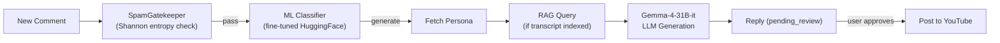

<p align="center">
  <h1 align="center">🚀 ReplyPilot</h1>
  <p align="center">
    <strong>AI-Powered YouTube Comment Management Platform</strong>
  </p>
  <p align="center">
    Automate comment classification, reply generation, and publishing — all from one dashboard.
  </p>
  <p align="center">
    <a href="#features">Features</a> •
    <a href="#architecture">Architecture</a> •
    <a href="#tech-stack">Tech Stack</a> •
    <a href="#getting-started">Getting Started</a> •
    <a href="#api-endpoints">API Endpoints</a> •
    <a href="#security">Security</a> •
    <a href="#license">License</a>
  </p>
</p>

---

## ✨ Features

- **🔐 Google OAuth 2.0** — Secure login with YouTube channel linking
- **📥 Auto Comment Sync** — Periodically fetches new comments from all your videos every 30 minutes
- **🤖 AI Intent Classification** — Custom fine-tuned model detects spam, praise, criticism, questions, and neutral comments; fast structural spam gate using Shannon entropy
- **💬 Smart Reply Generation** — LLM-powered replies using Google Gemma-4-31B-it with 12 customizable tone templates
- **🎭 Persona System** — Create multiple reply personas with custom bios and tones; AI-assisted persona analysis
- **📹 RAG-Powered Context** — Video transcript indexing with semantic search; asynchronous BRPOP queue consumer for non-blocking ingest
- **📊 Dashboard & Analytics** — Channel overview, video management, and comment insights
- **⚡ Background Processing** — BullMQ job queues with retry logic and exponential backoff
- **🛡️ Enterprise Security** — AES-256-GCM token encryption, CSRF protection, rate limiting, Helmet headers

---

## 🏗️ Architecture

ReplyPilot uses a **microservices architecture** with 5 independent services:

```
┌─────────────┐     ┌─────────────────┐     ┌──────────────────┐
│   React +   │────▶│   Express.js    │────▶│   BullMQ Worker  │
│   Vite UI   │     │   REST API      │     │   (Background)   │
│  (Port 5173)│     │  (Port 5000)    │     │                  │
└─────────────┘     └────────┬────────┘     └───────┬──────────┘
                             │                      │
                    ┌────────┴────────┐    ┌────────┴──────────┐
                    │    MongoDB      │    │  AI Service       │
                    │    Redis  ◀─────┼────│  FastAPI (8000)   │
                    │                 │    │                   │
                    └─────────────────┘    │  RAG Service      │
                                          │  FastAPI (8001)   │
                                          │  + BRPOP Consumer │
                                          └───────────────────┘
```

| Service | Description |
|---------|-------------|
| **Client** | React 18 + Vite frontend |
| **Server** | Express.js API with Passport.js auth, Redis sessions, cron jobs |
| **Worker** | Standalone BullMQ processor for classify, generate, and post-reply jobs |
| **AI Service** | FastAPI microservice — multi-stage intent classification + LLM reply generation |
| **RAG Service** | FastAPI microservice — 9-stage transcript ingest pipeline + semantic retrieval; async BRPOP queue consumer |

> For a comprehensive deep-dive including data flow diagrams, RAG pipeline stages, classify pipeline architecture, and deployment setup, see [`ARCHITECTURE.md`](./ARCHITECTURE.md).

---

## 🧠 How Replies Are Generated



---

## 🛠️ Tech Stack

| Layer | Technologies |
|-------|-------------|
| **Frontend** | React 18, Vite, React Router v6, Axios |
| **Backend API** | Node.js, Express.js, Passport.js, Mongoose, Winston |
| **Background Jobs** | BullMQ (Redis-backed), node-cron |
| **AI / NLP** | Python, FastAPI, HuggingFace Transformers, OpenAI SDK, Pydantic |
| **LLM** | Google Gemma-4-31B-it (HuggingFace Inference API) |
| **Embeddings** | BGE (BAAI General Embedding) via sentence-transformers |
| **Vector DB** | Pinecone |
| **Primary DB** | MongoDB (Mongoose ODM) |
| **Cache / Queue** | Redis (sessions, caching, token store, BullMQ, transcript store, RAG ingest queue) |
| **Auth** | Google OAuth 2.0, express-session + connect-redis |
| **Security** | Helmet, CORS, CSRF, AES-256-GCM encryption, Rate Limiting, Shannon entropy spam detection |
| **External API** | YouTube Data API v3 |
| **Infra** | Docker (client, server, RAG), Railway Nixpacks (AI Service) |
| **Logging** | Winston (Node.js), loguru structured JSON (Python) |

---

## 🚀 Getting Started

### Prerequisites

- **Node.js** ≥ 18
- **Python** ≥ 3.10
- **MongoDB** (local or Atlas)
- **Redis** (local or cloud)
- **Google Cloud Console** project with YouTube Data API v3 and OAuth 2.0 credentials
- **HuggingFace** API token (for LLM inference and private model access)
- **Pinecone** account (for RAG vector storage)

### 1. Clone the Repository

```bash
git clone https://github.com/ashutosh2652/ReplyPilot.git
cd ReplyPilot
```

### 2. Environment Variables

Each service has its own `.env` file. Refer to the `.env.example` / `.env.sample` in each directory.

#### `server/.env`

| Variable | Description |
|----------|-------------|
| `GOOGLE_CLIENT_ID` | Google OAuth 2.0 client ID |
| `GOOGLE_CLIENT_SECRET` | Google OAuth 2.0 client secret |
| `GOOGLE_REDIRECT_URI` | OAuth callback URL |
| `MONGODB_URI` | MongoDB connection string |
| `REDIS_URL` | Redis connection string |
| `SESSION_SECRET` | Express session secret (use a long random string) |
| `CLIENT_URL` | Frontend URL (e.g., `http://localhost:5173`) |
| `AI_SERVICE_URL` | AI service URL (e.g., `http://localhost:8000`) |
| `YOUTUBE_API_KEY` | YouTube Data API key |
| `ENCRYPTION_KEY` | 32-byte hex key for AES-256-GCM token encryption |

#### `worker/.env`

| Variable | Description |
|----------|-------------|
| `MONGODB_URI` | Shared MongoDB connection |
| `REDIS_URL` | Shared Redis connection |
| `AI_SERVICE_URL` | AI service base URL |
| `RAG_SERVICE_URL` | RAG service base URL |

#### `ai-service/.env`

| Variable | Description |
|----------|-------------|
| `HF_TOKEN` | HuggingFace API token |
| `RAG_SERVICE_URL` | RAG service base URL |
| `MODEL_REPO_ID` | HuggingFace repo for the fine-tuned classifier |

#### `rag/.env`

| Variable | Description |
|----------|-------------|
| `REDIS_URL` | Redis connection string |
| `PINECONE_API_KEY` | Pinecone API key |
| `PINECONE_INDEX_NAME` | Pinecone index name for transcript vectors |

### 3. Install & Run Each Service

#### Client (React Frontend)

```bash
cd client
npm install
npm run dev          # → http://localhost:5173
```

#### Server (Express API)

```bash
cd server
npm install
npm run dev          # → http://localhost:5000
```

#### Worker (BullMQ)

```bash
cd worker
npm install
npm run dev
```

#### AI Service (FastAPI)

```bash
cd ai-service
python -m venv .venv
source .venv/bin/activate
pip install -r requirements.txt
uvicorn app.main:app --port 8000 --reload
```

#### RAG Service (FastAPI + Queue Consumer)

```bash
cd rag
python -m venv .venv
source .venv/bin/activate
pip install -r requirements.txt
uvicorn app.main:app --port 8001 --reload
```

> The RAG Service automatically starts the `QueueConsumer` (Redis BRPOP) on startup to process transcript ingest jobs asynchronously.

---

## 📁 Project Structure

```
ReplyPilot/
├── client/                     # React + Vite Frontend
│   ├── src/
│   │   ├── api/                # Axios API modules (channel, comments, replies, personas)
│   │   ├── components/         # Shared UI (ProtectedRoute, VideoCard, CommentCard)
│   │   ├── context/            # AuthContext provider
│   │   ├── hooks/              # Custom hooks (useAuth)
│   │   ├── layouts/            # AppLayout wrapper
│   │   └── pages/              # 6 page components
│   └── vite.config.js
│
├── server/                     # Express.js Backend API
│   ├── server.js               # Entry point + graceful shutdown
│   └── src/
│       ├── config/             # env, db, redis, passport, cors
│       ├── controllers/        # Route controllers
│       ├── middleware/          # Auth, CSRF, rate limiter, YouTube token, logging, error
│       ├── models/             # Mongoose schemas (User, Channel, Video, Comment, Reply, Persona)
│       ├── routes/             # API route definitions
│       ├── services/           # Business logic (Channel, Queue, Reply, AI)
│       ├── mapper/             # Data transformation layers
│       ├── jobs/               # Cron jobs (syncComments)
│       └── utils/              # Crypto, logger, YouTube helpers
│
├── worker/                     # BullMQ Background Worker
│   ├── main.js                 # Entry point + shutdown handlers
│   ├── config/                 # DB, Redis, env config
│   ├── models/                 # Shared Mongoose models
│   ├── tasks/                  # classify, generate, postReply, youtubeSync, scheduler
│   └── utils/                  # HTTP client, logger, YouTube helpers
│
├── ai-service/                 # Python AI Microservice (Deploy: Railway Nixpacks)
│   ├── app/
│   │   ├── api/v1/             # Endpoints: classify, classify/batch, generate, generate/batch
│   │   ├── services/           # classify_service (SpamGatekeeper → ML → routing), generate, rag_client
│   │   ├── core/               # Pydantic Settings, loguru JSON logger
│   │   ├── model_files/        # Local fine-tuned intent classifier weights
│   │   ├── models/             # PyTorch models / training notebooks
│   │   ├── prompts/            # 12 tone templates + non_english_guard.txt
│   │   ├── schemas/            # Pydantic request/response models
│   │   └── main.py             # FastAPI app factory + lifespan
│   ├── nixpacks.toml           # Nixpacks build config (CPU-only PyTorch)
│   └── requirements.txt        # Locked dependencies
│
├── rag/                        # Python RAG Microservice (Deploy: Railway Docker)
│   ├── app/
│   │   ├── api/                # Routes (ingest, query, health/liveness + health/ready)
│   │   ├── pipeline/           # 9-stage ingest: IndexGuard → reader → cleaner → chunker → context → BGEEmbedder → payload → PineconeVectorStore → mark
│   │   ├── retrieval/          # query_embedder, searcher, reranker
│   │   ├── services/           # IngestOrchestrator, query service
│   │   ├── worker/             # QueueConsumer (Redis BRPOP, stall recovery, exponential backoff)
│   │   ├── core/               # loguru logger, Pydantic settings, exception hierarchy
│   │   └── main.py             # FastAPI app factory + lifespan (starts QueueConsumer)
│   ├── Dockerfile
│   ├── requirements.txt
│   └── scripts/                # benchmark_embedding.py, seed_redis.py
│
├── infra/
│   └── docker/                 # Dockerfiles for client & server
│
├── ARCHITECTURE.md             # Detailed system architecture documentation
└── README.md                   # ← You are here
```

---

## 🔄 How It Works

1. **User logs in** via Google OAuth → YouTube channel is linked
2. **Comments sync** automatically every 30 minutes via cron job
3. **Classification worker** picks up new comments → `SpamGatekeeper` (Shannon entropy fast check) → fine-tuned ML model classifies intent (spam / praise / criticism / question / neutral)
4. **Generation worker** drafts AI-powered replies using the user's selected persona + optional RAG context from indexed video transcript
5. **User reviews** replies on the dashboard → approves, edits, or rejects
6. **Post-reply worker** publishes approved replies directly to YouTube (with idempotency safeguards)
7. **RAG ingest** happens asynchronously via the BRPOP queue consumer — no blocking HTTP calls needed

---

## 📡 API Endpoints

### Server (Express.js — Port 5000)

| Route | Method | Description |
|-------|--------|-------------|
| `/api/auth/google` | GET | Initiate Google OAuth login |
| `/api/auth/google/callback` | GET | OAuth callback handler |
| `/api/auth/logout` | POST | Logout and destroy session |
| `/api/channel/sync` | POST | Sync channel info from YouTube |
| `/api/channel/videos` | GET | List synced videos |
| `/api/channel/videos/:videoId/comments` | GET | Fetch comments for a video |
| `/api/comments` | GET | List/filter all comments |
| `/api/comments/:id/intent` | PATCH | Manually update comment intent |
| `/api/personas` | GET/POST | List / create reply personas |
| `/api/personas/:id` | GET/PUT/DELETE | CRUD on a single persona |
| `/api/batch/classify` | POST | Bulk classify comments |
| `/api/batch/generate` | POST | Bulk generate replies |
| `/api/replies` | GET | List generated replies |
| `/api/replies/:id/approve` | POST | Approve and enqueue for publishing |
| `/api/replies/:id` | DELETE | Delete a reply |
| `/health` | GET | Service liveness probe |

### AI Service (FastAPI — Port 8000)

| Route | Method | Description |
|-------|--------|-------------|
| `/api/v1/classify` | POST | Classify single comment intent |
| `/api/v1/classify/batch` | POST | Batch classify comments |
| `/api/v1/generate` | POST | Generate a single reply |
| `/api/v1/generate/batch` | POST | Batch generate replies |

### RAG Service (FastAPI — Port 8001)

| Route | Method | Description |
|-------|--------|-------------|
| `/api/v1/ingest` | POST | Enqueue transcript for async ingestion |
| `/api/v1/query` | POST | Semantic search over indexed transcripts |
| `/health` | GET | Liveness probe (always 200) |
| `/health/ready` | GET | Readiness probe (checks Redis + Pinecone) |

---

## 🔒 Security

- **AES-256-GCM** encryption for Google refresh tokens at rest
- **Redis-backed sessions** with 7-day TTL and session regeneration on login
- **CSRF protection** on all state-changing endpoints
- **Rate limiting** with Redis store to prevent API abuse
- **Helmet** HTTP security headers
- **CORS** whitelist configuration
- **User data caching** (15-min TTL) to minimize database exposure
- **Shannon entropy spam detection** — fast-path structural check that rejects keyboard-smash and random-string comments before the ML model runs

---

## 📄 License

This project is licensed under the **MIT License** — see the [LICENSE](./LICENSE) file for details.

---

<p align="center">
  Built with ❤️ by <strong>Ashutosh</strong>
</p>
