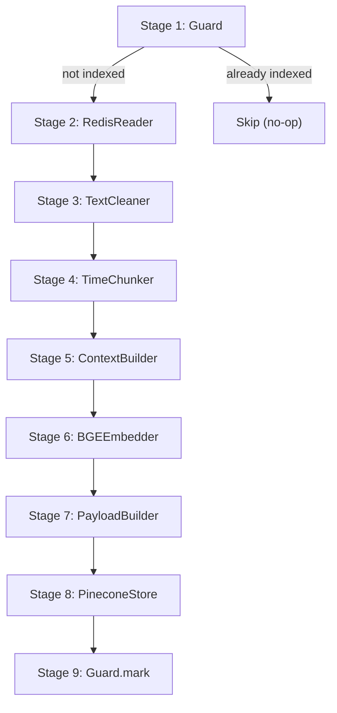
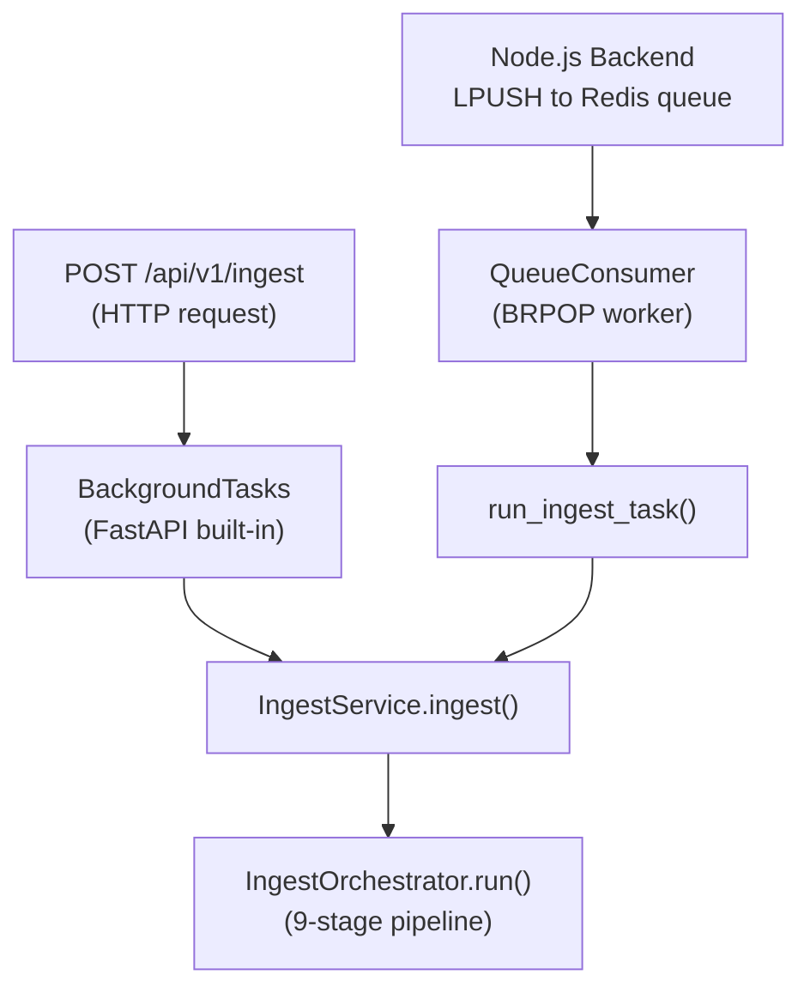

# RAG Service — Complete Architecture & Flow Report


---

## 1. What Is the RAG Service?

The RAG (Retrieval-Augmented Generation) service is a **standalone Python microservice** that gives the ReplyPilot platform the ability to answer questions about YouTube video content. It does this by:

1. **Ingesting** YouTube transcripts — cleaning, chunking, embedding, and storing them as vectors.
2. **Retrieving** the most relevant transcript chunks when a user or the AI service asks a question about a video.

The service deliberately does **NOT** call an LLM itself. It returns raw transcript chunks so the AI service (the reply generation pipeline) can inject them as context for LLM prompts. This keeps the pipeline modular and testable.

---

## 2. Technology Stack

| Layer | Technology | Why |
|---|---|---|
| **Framework** | FastAPI (Python 3.11) | Async-native, OpenAPI docs, Pydantic validation |
| **Embedding Model** | `BAAI/bge-base-en-v1.5` via `sentence-transformers` | 768-dim, fast, accurate for English, CPU-friendly |
| **Vector DB** | Pinecone (Serverless, AWS us-east-1) | Managed, scales to zero, cosine similarity search |
| **Message Queue** | Redis (BRPOP) | Shared with Node.js backend, simple, reliable |
| **Transcript Store** | Redis (`transcript:{videoId}`) | Same Redis as the queue — no extra infra |
| **Reranker** (optional) | `cross-encoder/ms-marco-MiniLM-L-6-v2` | Improves precision via cross-encoding, ~80MB, CPU |
| **Logging** | Loguru (structured JSON in prod, coloured in dev) | Single-line JSON for log aggregators |
| **Config** | Pydantic Settings + [.env](file:///home/ashutosh/MAIN/ASHUTOSH%20PD/ReplyPilot/rag/.env) | Type-safe, validated at startup |
| **Container** | Docker (python:3.11-slim) + CPU-only PyTorch | Keeps image small (~1GB), no GPU dependency |

---

## 3. Directory Structure

```
rag/
├── app/
│   ├── main.py                          # FastAPI app factory + lifespan
│   ├── api/
│   │   ├── middleware/
│   │   │   └── error_handler.py         # Global error → JSON middleware
│   │   └── routes/
│   │       ├── health.py                # /health + /health/ready probes
│   │       ├── ingest.py                # POST /api/v1/ingest (+ batch, status)
│   │       └── query.py                 # POST /api/v1/query (+ batch)
│   ├── core/
│   │   ├── config.py                    # Settings singleton (Pydantic)
│   │   ├── exceptions.py                # 15 typed exceptions
│   │   └── logger.py                    # Structured loguru logger
│   ├── pipeline/                        # ── INGEST PIPELINE ──
│   │   ├── orchestrator.py              # 9-stage master controller
│   │   ├── ingestion/
│   │   │   ├── guard.py                 # Dedup guard (indexed:{videoId})
│   │   │   ├── redis_reader.py          # Fetch transcript from Redis
│   │   │   └── text_cleaner.py          # Strip noise from captions
│   │   ├── chunking/
│   │   │   ├── models.py                # Chunk + ChunkBatch models
│   │   │   ├── token_splitter.py        # Time-window chunker
│   │   │   └── context_builder.py       # Contextual retrieval prefix
│   │   ├── embedding/
│   │   │   ├── base.py                  # Abstract EmbeddingProvider
│   │   │   ├── bge_embedder.py          # BGE singleton implementation
│   │   │   ├── batch_manager.py         # Sub-batching + retry
│   │   │   └── models.py               # EmbeddingResult/Batch models
│   │   └── storage/
│   │       ├── models.py                # VectorRecord + UpsertResult
│   │       ├── payload_builder.py       # Chunk → Pinecone metadata builder
│   │       └── pinecone_client.py       # Singleton Pinecone client
│   ├── retrieval/                       # ── RETRIEVAL PIPELINE ──
│   │   ├── query_embedder.py            # Wraps BGE for query-time
│   │   ├── searcher.py                  # Embed → Pinecone → filter
│   │   └── reranker.py                  # Optional cross-encoder
│   ├── services/
│   │   ├── ingest_service.py            # Business logic for ingest
│   │   └── query_service.py             # Business logic for query
│   └── worker/
│       ├── queue_consumer.py            # Redis BRPOP consumer (separate process)
│       └── tasks.py                     # Task definitions for worker
├── scripts/
│   ├── benchmark_embedding.py           # Compare BGE model variants
│   ├── inspect_index.py                 # Inspect Pinecone index
│   └── seed_redis.py                    # Push test transcript to Redis
├── Dockerfile
├── pyproject.toml
├── requirements.txt
└── .env / .env.sample
```

---

## 4. The Two Pipelines — In Detail

### 4.1 Ingest Pipeline (9 Stages)

The ingest pipeline converts a YouTube transcript stored in Redis into searchable vectors in Pinecone. The [orchestrator.py](file:///home/ashutosh/MAIN/ASHUTOSH%20PD/ReplyPilot/rag/app/pipeline/orchestrator.py) is the single source of truth for stage ordering.



| Stage | File | What | Why |
|---|---|---|---|
| **1. Guard** | [guard.py](file:///home/ashutosh/MAIN/ASHUTOSH%20PD/ReplyPilot/rag/app/pipeline/ingestion/guard.py) | Checks `indexed:{videoId}` in Redis | Prevents duplicate work. If `force_reindex=true`, clears the flag and deletes old Pinecone vectors first. |
| **2. RedisReader** | [redis_reader.py](file:///home/ashutosh/MAIN/ASHUTOSH%20PD/ReplyPilot/rag/app/pipeline/ingestion/redis_reader.py) | Fetches `transcript:{videoId}` JSON from Redis | The Node.js backend stores transcripts from YouTube's API as JSON arrays of `{text, start, duration}` segments. |
| **3. TextCleaner** | [text_cleaner.py](file:///home/ashutosh/MAIN/ASHUTOSH%20PD/ReplyPilot/rag/app/pipeline/ingestion/text_cleaner.py) | Strips HTML tags, `[Music]`/`[Applause]` annotations, filler words (uh, um), control chars, duplicate segments | Auto-generated YouTube captions are noisy. Cleaning improves embedding quality. |
| **4. TimeChunker** | [token_splitter.py](file:///home/ashutosh/MAIN/ASHUTOSH%20PD/ReplyPilot/rag/app/pipeline/chunking/token_splitter.py) | Groups segments into fixed time windows (default 60s) | Time-based (not token-based) so chunks map to video timestamps, enabling deep-links like `?t=120`. |
| **5. ContextBuilder** | [context_builder.py](file:///home/ashutosh/MAIN/ASHUTOSH%20PD/ReplyPilot/rag/app/pipeline/chunking/context_builder.py) | Prepends last 2 sentences of the previous chunk to each chunk's embedding text | "Contextual Retrieval" technique — a chunk starting at t=60s often begins mid-topic. The prefix gives the embedding model discourse context. `raw_text` stays clean for display. |
| **6. BGEEmbedder** | [bge_embedder.py](file:///home/ashutosh/MAIN/ASHUTOSH%20PD/ReplyPilot/rag/app/pipeline/embedding/bge_embedder.py) | Generates 768-dim vectors using `BAAI/bge-base-en-v1.5` | Singleton model, thread-safe lazy loading. Sub-batches (default 32 chunks/batch) with exponential backoff retry via [batch_manager.py](file:///home/ashutosh/MAIN/ASHUTOSH%20PD/ReplyPilot/rag/app/pipeline/embedding/batch_manager.py). |
| **7. PayloadBuilder** | [payload_builder.py](file:///home/ashutosh/MAIN/ASHUTOSH%20PD/ReplyPilot/rag/app/pipeline/storage/payload_builder.py) | Zips chunks + vectors into [VectorRecord](file:///home/ashutosh/MAIN/ASHUTOSH%20PD/ReplyPilot/rag/app/pipeline/storage/models.py#10-18) objects | Stores `raw_text`, `video_id`, `video_title`, `channel_name`, `chunk_index`, `start_time_seconds`, `end_time_seconds` as Pinecone metadata for filtered search and result display. |
| **8. PineconeStore** | [pinecone_client.py](file:///home/ashutosh/MAIN/ASHUTOSH%20PD/ReplyPilot/rag/app/pipeline/storage/pinecone_client.py) | Upserts vectors in batches of 100 into Pinecone | Singleton client. Auto-creates the index if it doesn't exist. All SDK calls wrapped in `run_in_executor` (Pinecone SDK is sync). |
| **9. Guard.mark** | [guard.py](file:///home/ashutosh/MAIN/ASHUTOSH%20PD/ReplyPilot/rag/app/pipeline/ingestion/guard.py#L67-L93) | Writes `indexed:{videoId}` with JSON metadata (chunk_count, window, timestamp) | Marks ingest complete so future requests skip it. JSON value (not plain "1") enables `/ingest/status` to return metadata. |

### 4.2 Retrieval Pipeline (3 Steps)


| Step | File | What | Why |
|---|---|---|---|
| **1. Embed** | [query_embedder.py](file:///home/ashutosh/MAIN/ASHUTOSH%20PD/ReplyPilot/rag/app/retrieval/query_embedder.py) | Embeds the question with BGE query prefix `"Represent this sentence for searching relevant passages: "` | BGE's asymmetric protocol: queries get an instruction prefix, passages don't. Uses the same singleton model. |
| **2. Search + Filter** | [searcher.py](file:///home/ashutosh/MAIN/ASHUTOSH%20PD/ReplyPilot/rag/app/retrieval/searcher.py) | Queries Pinecone (2× top_k), filters by `score_threshold` (default 0.65) | Over-fetches then filters to ensure enough high-quality results. Optional `video_id` filter for scoped search. |
| **3. Rerank** (optional) | [reranker.py](file:///home/ashutosh/MAIN/ASHUTOSH%20PD/ReplyPilot/rag/app/retrieval/reranker.py) | Cross-encoder re-scores [(question, chunk)](file:///home/ashutosh/MAIN/ASHUTOSH%20PD/ReplyPilot/rag/app/worker/queue_consumer.py#152-197) pairs | Bi-encoder retrieval is fast but approximate. Cross-encoder is more accurate. Disabled by default (`RERANKER_ENABLED=false`). Gracefully falls back on failure. |

---

## 5. API Endpoints

| Method | Path | Description | Response |
|---|---|---|---|
| `GET` | `/health` | Liveness probe (process alive?) | `200` always |
| `GET` | `/health/ready` | Readiness probe (Redis + Pinecone OK?) | `200` or `503` |
| `POST` | `/api/v1/ingest` | Ingest one video transcript | `202 Accepted` |
| `POST` | `/api/v1/ingest/batch` | Ingest up to 20 videos | `202 Accepted` |
| `GET` | `/api/v1/ingest/status/{video_id}` | Check if video is indexed | `200` |
| `POST` | `/api/v1/query` | Semantic search across transcripts | Chunk results |
| `POST` | `/api/v1/query/batch` | Batch query (up to 5 questions) | Array of results |

---

## 6. Two Ingestion Modes

The service supports **two paths** for triggering ingest — both converge on the same [IngestService](file:///home/ashutosh/MAIN/ASHUTOSH%20PD/ReplyPilot/rag/app/services/ingest_service.py#21-79):



| Mode | When to Use | File |
|---|---|---|
| **HTTP Background Task** | Low-to-medium volume, dev environments | [ingest.py](file:///home/ashutosh/MAIN/ASHUTOSH%20PD/ReplyPilot/rag/app/api/routes/ingest.py) |
| **Redis Queue Worker** | Production, heavy volume, crash recovery | [queue_consumer.py](file:///home/ashutosh/MAIN/ASHUTOSH%20PD/ReplyPilot/rag/app/worker/queue_consumer.py) + [tasks.py](file:///home/ashutosh/MAIN/ASHUTOSH%20PD/ReplyPilot/rag/app/worker/tasks.py) |

---

## 7. Worker — Crash Recovery & Dead Letters

The [QueueConsumer](file:///home/ashutosh/MAIN/ASHUTOSH%20PD/ReplyPilot/rag/app/worker/queue_consumer.py) implements production-grade reliability:

| Feature | How |
|---|---|
| **Crash recovery** | On startup, [_recover_processing_jobs()](file:///home/ashutosh/MAIN/ASHUTOSH%20PD/ReplyPilot/rag/app/worker/queue_consumer.py#89-106) moves stuck jobs from `rag:ingest:processing` back to `rag:ingest:queue`. |
| **At-least-once delivery** | Job is pushed to `rag:ingest:processing` BEFORE work starts, removed AFTER success. |
| **Retry with backoff** | Failed jobs retry up to 3 times with exponential backoff (5s → 10s → 20s). |
| **Dead-letter queue** | After max retries, job is moved to `rag:ingest:dead` with full error context. |
| **Graceful shutdown** | SIGINT/SIGTERM handlers set `_running = False`, completing the current job before stopping. |
| **Auto-reconnect** | Connection loss triggers exponential backoff reconnect (2s → 4s → … → 30s cap). |

---

## 8. Exception Hierarchy

All custom exceptions inherit from [YTRagBaseException](file:///home/ashutosh/MAIN/ASHUTOSH%20PD/ReplyPilot/rag/app/core/exceptions.py#14-26) and carry a machine-readable [code](file:///home/ashutosh/MAIN/ASHUTOSH%20PD/ReplyPilot/rag/app/api/middleware/error_handler.py#58-60) + human-readable `message`. The error handler middleware maps them to HTTP status codes:

| Exception | Code | HTTP Status |
|---|---|---|
| [InvalidRequestError](file:///home/ashutosh/MAIN/ASHUTOSH%20PD/ReplyPilot/rag/app/core/exceptions.py#153-156) | `INVALID_REQUEST` | 400 |
| [TranscriptNotFoundError](file:///home/ashutosh/MAIN/ASHUTOSH%20PD/ReplyPilot/rag/app/core/exceptions.py#35-41) | `TRANSCRIPT_NOT_FOUND` | 404 |
| [TranscriptAlreadyIndexedError](file:///home/ashutosh/MAIN/ASHUTOSH%20PD/ReplyPilot/rag/app/core/exceptions.py#43-49) | `TRANSCRIPT_ALREADY_INDEXED` | 409 |
| [NoRelevantChunksError](file:///home/ashutosh/MAIN/ASHUTOSH%20PD/ReplyPilot/rag/app/core/exceptions.py#127-134) | `NO_RELEVANT_CHUNKS` | 422 |
| [RedisConnectionError](file:///home/ashutosh/MAIN/ASHUTOSH%20PD/ReplyPilot/rag/app/core/exceptions.py#30-33) | `REDIS_CONNECTION_ERROR` | 503 |
| [PineconeConnectionError](file:///home/ashutosh/MAIN/ASHUTOSH%20PD/ReplyPilot/rag/app/core/exceptions.py#100-103) | `PINECONE_CONNECTION_ERROR` | 503 |
| [EmbeddingError](file:///home/ashutosh/MAIN/ASHUTOSH%20PD/ReplyPilot/rag/app/core/exceptions.py#73-76) | `EMBEDDING_ERROR` | 503 |
| All others | `INTERNAL_ERROR` | 500 |

All error responses follow a consistent JSON envelope:
```json
{
  "success": false,
  "error": {
    "code": "TRANSCRIPT_NOT_FOUND",
    "message": "No transcript found in Redis for video_id='abc123'.",
    "detail": "Expected key: transcript:abc123"
  },
  "request_id": "uuid-here"
}
```

---

## 9. Configuration & Key Settings

From [config.py](file:///home/ashutosh/MAIN/ASHUTOSH%20PD/ReplyPilot/rag/app/core/config.py):

| Setting | Default | Purpose |
|---|---|---|
| `BGE_MODEL_NAME` | `BAAI/bge-base-en-v1.5` | Embedding model (768-dim) |
| `BGE_BATCH_SIZE` | 32 | Chunks per embedding inference call |
| `CHUNK_WINDOW_SECONDS` | 60 | Time window for transcript chunking |
| `CONTEXT_PREFIX_SENTENCES` | 2 | Sentences from prev chunk used as context prefix |
| `RETRIEVAL_TOP_K` | 4 | Default chunks returned from search |
| `RETRIEVAL_SCORE_THRESHOLD` | 0.65 | Minimum cosine similarity to include |
| `RERANKER_ENABLED` | false | Cross-encoder reranking toggle |
| `PINECONE_DIMENSION` | 768 | Must match embedding model output |
| `WORKER_MAX_RETRIES` | 3 | Max retries before dead-lettering |

---

## 10. Key Design Decisions (Why)

### Why time-based chunking instead of token-based?
Users think in timestamps, not token counts. Time-based chunks enable deep-links (`?t=120`), provide consistent granularity regardless of speaking pace, and work naturally with auto-generated captions.

### Why contextual retrieval (context prefix)?  
A chunk starting at t=60s often begins mid-topic. By prepending the last 2 sentences of the previous chunk to `text_for_embedding`, the BGE model understands the discourse thread. The `raw_text` displayed to users stays clean. This is based on Anthropic's "Contextual Retrieval" research.

### Why the BGE asymmetric encoding protocol?
BGE models are trained with a query-side instruction prefix (`"Represent this sentence for searching relevant passages: "`). Passages/chunks at index time do NOT get this prefix. This asymmetric encoding is critical for retrieval quality.

### Why a separate worker process?
The HTTP API returns `202 Accepted` immediately for fast response times. Heavy work (embedding, Pinecone writes) runs either in FastAPI `BackgroundTasks` (dev) or a dedicated Redis BRPOP worker (production). The worker provides crash recovery, retries, and dead-letter handling.

### Why store `raw_text` in Pinecone metadata?
Avoids a separate database lookup at query time. Pinecone returns the text alongside the vector match, making retrieval a single call.

### Why singleton patterns for BGE and Pinecone?
The BGE model is ~400MB+ and takes seconds to load. The Pinecone client maintains a connection. Both are loaded once and shared across all requests via thread-safe singletons.

---

## 11. Graphify-Out Analysis Summary

From the [GRAPH_REPORT.md](file:///home/ashutosh/MAIN/ASHUTOSH%20PD/ReplyPilot/graphify-out/GRAPH_REPORT.md) analysis:

- **683 nodes, 1129 edges, 114 communities** detected across the entire ReplyPilot codebase.
- The RAG service's community is **"RAG Pipeline & Embedding"** (Community 7, cohesion 0.14, 20 nodes).
- **God Nodes** — the most connected abstractions in the RAG service:
  - [YTRagBaseException](file:///home/ashutosh/MAIN/ASHUTOSH%20PD/ReplyPilot/rag/app/core/exceptions.py#14-26) (28 edges) — root of all custom exceptions
  - [RedisConnectionError](file:///home/ashutosh/MAIN/ASHUTOSH%20PD/ReplyPilot/rag/app/core/exceptions.py#30-33) (27 edges) — central to all data access
  - [BGEEmbedder](file:///home/ashutosh/MAIN/ASHUTOSH%20PD/ReplyPilot/rag/app/pipeline/embedding/bge_embedder.py#48-168) (25 edges) — core embedding singleton
  - [ChunkBatch](file:///home/ashutosh/MAIN/ASHUTOSH%20PD/ReplyPilot/rag/app/pipeline/chunking/models.py#39-45) (25 edges) — data structure flowing through the pipeline
  - [PineconeVectorStore](file:///home/ashutosh/MAIN/ASHUTOSH%20PD/ReplyPilot/rag/app/pipeline/storage/pinecone_client.py#39-254) (24 edges) — storage singleton
- **Hyperedge**: "Data Persistence and Storage Strategy" groups MongoDB, Redis, and Pinecone as the three data stores.
- The RAG service connects to the broader system via the **reply generation pipeline** in the AI service, which calls the RAG `/query` endpoint to fetch transcript context before generating replies.

---

## 12. Complete End-to-End Flow

### Ingest Flow (Full)
```
1. Node.js backend syncs a YouTube video and stores its transcript in Redis
   as JSON: transcript:{videoId} = [{text, start, duration}, ...]

2. Backend triggers ingest via either:
   a. HTTP POST /api/v1/ingest → 202 Accepted → BackgroundTask
   b. LPUSH to rag:ingest:queue → Worker BRPOP picks it up

3. IngestService → IngestOrchestrator.run()
   Stage 1: Guard checks indexed:{videoId} → skip if already done
   Stage 2: RedisReader fetches transcript:{videoId} from Redis
   Stage 3: TextCleaner strips HTML, annotations, fillers, duplicates
   Stage 4: TimeChunker groups segments into 60s windows → ChunkBatch
   Stage 5: ContextBuilder prepends prev-chunk context to embedding text
   Stage 6: BGEEmbedder generates 768-dim vectors (batches of 32)
   Stage 7: PayloadBuilder zips chunks + vectors → VectorRecords
   Stage 8: PineconeStore upserts in batches of 100
   Stage 9: Guard.mark writes indexed:{videoId} with metadata

4. Video is now searchable via /api/v1/query
```

### Query Flow (Full)
```
1. AI service (or Node.js backend) sends POST /api/v1/query
   with: { question, video_id? (optional scope), top_k, score_threshold }

2. QueryService → Searcher.search()
   Step 1: QueryEmbedder embeds question with BGE query prefix
   Step 2: Pinecone query (2× top_k, optional video_id filter)
   Step 3: Score threshold filter (discard < 0.65)
   Step 4: Optional reranker (cross-encoder, if enabled)

3. Returns list of chunks with:
   - text (raw transcript for that time window)
   - score (cosine similarity)
   - metadata: video_id, video_title, channel_name
   - timestamps: start_time_seconds, end_time_seconds
   - chunk_index for ordering

4. Caller (AI service) injects these chunks as context
   into the LLM prompt for reply generation
```