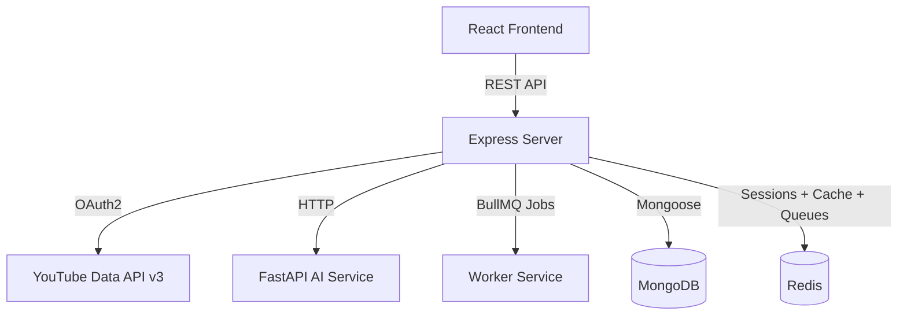
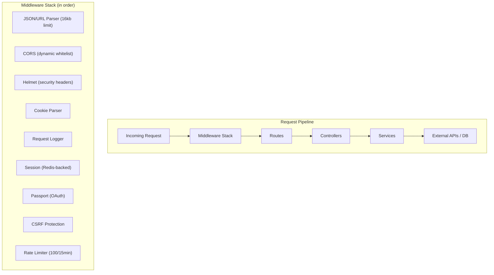
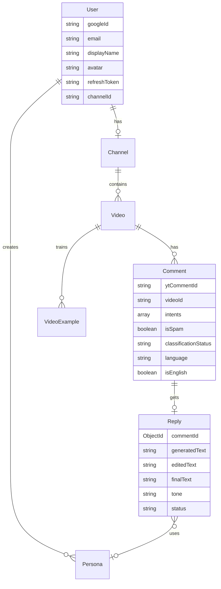
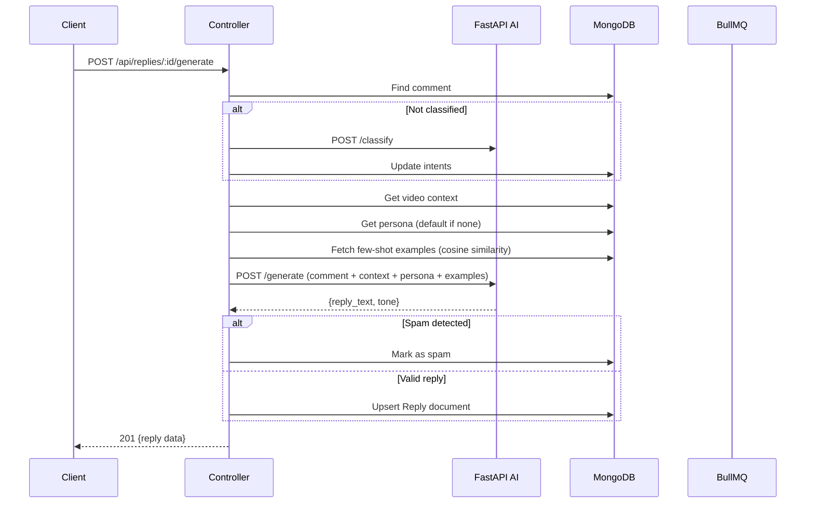
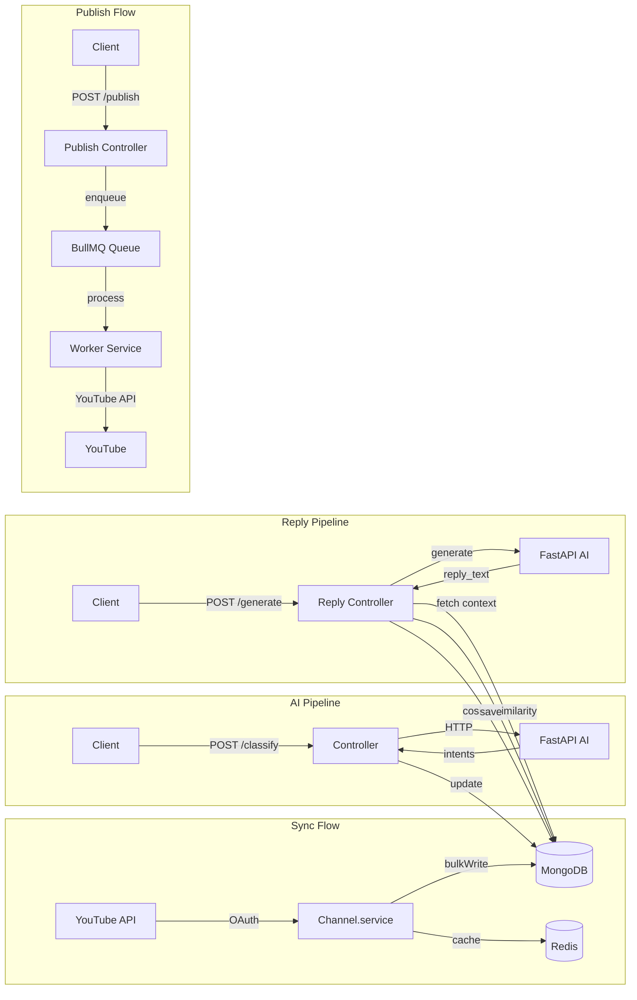

# ReplyPilot Server — Detailed Architecture Report


---

## 1. What Is the Server?

The **server** is the **Node.js/Express backend** of ReplyPilot — an AI-powered YouTube comment management platform. It acts as the **central orchestration layer** between:

- The **React frontend** (client)
- The **Python FastAPI AI service** (classification & reply generation)
- The **BullMQ worker** (async job processing)
- **YouTube Data API v3** (channel/video/comment sync)
- **MongoDB** (persistent storage) and **Redis** (caching, sessions, job queues)



---

## 2. Directory Structure — What & Why

```
server/
├── server.js                     # Entry point — bootstrap, retry loop, graceful shutdown
├── package.json                  # Dependencies & scripts
└── src/
    ├── app.js                    # Express app factory — middleware pipeline + route mounting
    ├── config/                   # Centralized configuration
    │   ├── env.js                # Zod-validated environment variables
    │   ├── db.js                 # MongoDB connection (Mongoose)
    │   ├── redis.js              # Dual Redis clients (node-redis + ioredis)
    │   ├── cors.js               # Dynamic CORS whitelist
    │   ├── passport.js           # Google OAuth strategy + session serialization
    │   └── constants.js          # YouTube API scopes
    ├── controllers/              # Route handlers (business logic orchestration)
    │   ├── Channel.controller.js # Channel/video/comment CRUD + YouTube sync
    │   ├── comments.controller.js# Comment listing, classification, search
    │   ├── reply.controller.js   # Reply generation, approval workflow, publishing
    │   ├── Persona.controller.js # Creator persona CRUD
    │   └── batch.controller.js   # Bulk classify/generate job enqueue
    ├── services/                 # Business logic & external integrations
    │   ├── Channel.service.js    # YouTube API interactions + DB sync
    │   ├── aiService.js          # AI classification HTTP client
    │   ├── replyService.js       # AI reply generation HTTP client
    │   └── queue.service.js      # BullMQ queue definitions + job helpers
    ├── models/                   # Mongoose schemas (7 collections)
    │   ├── User.models.js        # Google OAuth user profile
    │   ├── Channel.models.js     # YouTube channel metadata
    │   ├── Video.models.js       # Video details + statistics
    │   ├── Comment.models.js     # Comments with intent classification
    │   ├── Reply.models.js       # AI-generated/manual replies
    │   ├── Persona.models.js     # Creator persona profiles
    │   └── VideoExample.models.js# Few-shot learning examples
    ├── middleware/                # Express middleware chain
    │   ├── auth.middleware.js     # Session-based auth guard
    │   ├── csrf.middleware.js     # Origin/Referer CSRF protection
    │   ├── error.middleware.js    # Global error handler
    │   ├── rateLimiter.middleware.js # API + auth rate limiting
    │   ├── requestLogger.middleware.js # HTTP request logging
    │   └── youtubeToken.middleware.js  # Token refresh middleware
    ├── routes/                   # Express route definitions
    │   ├── auth.routes.js        # /api/auth — OAuth login/callback/logout
    │   ├── Channel.routes.js     # /api/channel — channel & video endpoints
    │   ├── comments.routes.js    # /api/comments — comment management
    │   ├── Persona.routes.js     # /api/personas — persona CRUD
    │   ├── batch.routes.js       # /api/batch — bulk operations
    │   └── reply.routes.js       # /api/replies — reply lifecycle
    ├── mapper/                   # YouTube API ↔ MongoDB field mappers
    │   ├── Channel.mapper.js     # Raw channel → DB schema
    │   ├── Video.mapper.js       # Raw video → DB schema
    │   └── Comment.mapper.js     # Raw comment → DB schema
    ├── jobs/                     # Scheduled tasks
    │   └── syncComments.job.js   # Cron: sync comments every 30 min
    └── utils/                    # Shared utilities
        ├── ApiError.js           # Custom error class with status codes
        ├── crypto.js             # AES-256-GCM token encryption
        ├── httpClient.js         # Axios helper
        ├── logger.js             # Winston + daily rotate file logging
        ├── paginate.js           # YouTube pagination helpers
        ├── youtubeClient.js      # Google API client factory
        └── youtubeToken.helper.js# OAuth token refresh with race protection
```

---

## 3. Architecture Pattern — Layered MVC with Service Layer



| Layer | Responsibility | Why |
|-------|---------------|-----|
| **Middleware** | Cross-cutting concerns: auth, security, logging, rate limiting | Separates concerns; each middleware is single-responsibility |
| **Routes** | HTTP method + URL mapping | Clean API contract; maps URLs to controller methods |
| **Controllers** | Request validation, orchestration, response formatting | Keeps route files thin; orchestrates service calls |
| **Services** | Business logic, external API calls, DB operations | Reusable across controllers; testable in isolation |
| **Models** | Data schema + validation + indexes | Single source of truth for data structure |
| **Mappers** | Transform YouTube API responses to internal schema | Decouples external API shape from internal models |

---

## 4. Deep Dive — Each Component

### 4.1 Entry Point: [server.js](file:///home/ashutosh/MAIN/ASHUTOSH%20PD/ReplyPilot/server/server.js)

**What**: Bootstraps the app with exponential-backoff retry logic.

**Why**: Production resilience — if MongoDB or Redis is temporarily unavailable at startup, the server retries with 5s → 10s → 20s → 60s (capped) delays instead of crashing.

**Key behaviors**:
- Connects to MongoDB via [connectdb()](file:///home/ashutosh/MAIN/ASHUTOSH%20PD/ReplyPilot/server/src/config/db.js#13-25)
- Starts the comment sync cron job
- Listens on `PORT` (env → fallback 3000)
- Handles `SIGTERM`/`SIGINT` for graceful shutdown: stops cron → disconnects DB → closes HTTP server

---

### 4.2 App Factory: [app.js](file:///home/ashutosh/MAIN/ASHUTOSH%20PD/ReplyPilot/server/src/app.js)

**What**: Creates and configures the Express application.

**Why**: Separates app creation from server startup (testability).

**Middleware pipeline** (order matters):

| Order | Middleware | Purpose |
|-------|-----------|---------|
| 1 | `express.json()` | Parse JSON bodies (16kb limit prevents abuse) |
| 2 | `express.urlencoded()` | Parse form data |
| 3 | [cors()](file:///home/ashutosh/MAIN/ASHUTOSH%20PD/ReplyPilot/server/src/config/cors.js#19-29) | Dynamic origin whitelist via [cors.js](file:///home/ashutosh/MAIN/ASHUTOSH%20PD/ReplyPilot/server/src/config/cors.js) |
| 4 | `helmet()` | Security headers (XSS, HSTS, etc.) |
| 5 | `cookieParser()` | Parse session cookies |
| 6 | [requestLogger](file:///home/ashutosh/MAIN/ASHUTOSH%20PD/ReplyPilot/server/src/middleware/requestLogger.middleware.js#3-23) | Log every HTTP request with timing |
| 7 | `trust proxy` | Needed for Railway/Docker reverse proxy |
| 8 | [session](file:///home/ashutosh/MAIN/ASHUTOSH%20PD/ReplyPilot/server/src/config/redis.js#64-65) | Redis-backed sessions (7-day TTL, `sameSite: none` in prod) |
| 9 | `passport` | Google OAuth authentication |
| 10 | [csrfProtection](file:///home/ashutosh/MAIN/ASHUTOSH%20PD/ReplyPilot/server/src/middleware/csrf.middleware.js#4-48) | Origin/Referer validation on state-changing requests |
| 11 | `apilimiter` | 100 req/15min per IP on `/api` routes |

---

### 4.3 Configuration Layer (`config/`)

#### [env.js](file:///home/ashutosh/MAIN/ASHUTOSH%20PD/ReplyPilot/server/src/config/env.js) — Zod Environment Validation
**What**: Validates all environment variables at startup using Zod schemas.  
**Why**: Fails fast with clear error messages if any required env var is missing/malformed. Prevents runtime crashes from config issues.

**Key variables validated**: `MONGODB_URI`, `GOOGLE_CLIENT_ID/SECRET`, `SESSION_SECRET` (≥32 chars), `TOKEN_ENCRYPTION_KEY`, `REDIS_URL`, `YOUTUBE_API_KEY`, `CORS_WHITELIST` (comma-split → array).

#### [db.js](file:///home/ashutosh/MAIN/ASHUTOSH%20PD/ReplyPilot/server/src/config/db.js) — MongoDB Connection
**What**: Mongoose connection with connection pooling (2–10 connections), 5s server selection timeout.  
**Why**: Pool prevents connection starvation under load; timeout prevents hanging during outages.

Includes auto-reconnect event listeners and an `isConnected` guard to prevent duplicate connections.

#### [redis.js](file:///home/ashutosh/MAIN/ASHUTOSH%20PD/ReplyPilot/server/src/config/redis.js) — Dual Redis Clients
**What**: Two separate Redis connections:
1. **`node-redis`** client → session store + caching + token storage
2. **`ioredis`** client → BullMQ queue backend

**Why**: BullMQ requires `ioredis` (not compatible with `node-redis`). Both clients have reconnect strategies and 60s ping intervals to prevent idle disconnects.

Also exports **key factories** for consistent Redis key naming:
- `yt:access_token:{userId}`, `yt:token_expiry:{userId}`, `cache:channel:{id}`, `cache:video:{id}`, `session:{id}`

#### [passport.js](file:///home/ashutosh/MAIN/ASHUTOSH%20PD/ReplyPilot/server/src/config/passport.js) — Google OAuth Strategy
**What**: Configures Google OAuth 2.0 with YouTube API scopes.  
**Why**: Users authenticate via Google to grant YouTube channel access.

**Key behaviors**:
- On OAuth callback: encrypts refresh token → stores in MongoDB, caches access token in Redis (55min TTL)
- `deserializeUser` uses **Redis cache first** (15min TTL) before hitting MongoDB — eliminates DB query on every request
- Exports [invalidateUserCache()](file:///home/ashutosh/MAIN/ASHUTOSH%20PD/ReplyPilot/server/src/config/passport.js#96-102) for profile updates

#### [cors.js](file:///home/ashutosh/MAIN/ASHUTOSH%20PD/ReplyPilot/server/src/config/cors.js) — Dynamic CORS
**What**: Whitelist-based CORS with credentials support.  
**Why**: Allows the React frontend origin while blocking unauthorized origins. Supports comma-separated whitelist for multi-environment deployment.

#### [constants.js](file:///home/ashutosh/MAIN/ASHUTOSH%20PD/ReplyPilot/server/src/config/constants.js) — YouTube Scopes
**What**: Defines OAuth scopes: `profile`, `email`, `youtube.readonly`, `youtube.force-ssl`.  
**Why**: `force-ssl` enables writing (posting replies) to YouTube.

---

### 4.4 Models Layer (`models/`) — 7 MongoDB Collections



| Model | Purpose | Key Design Choice |
|-------|---------|-------------------|
| **User** | Google OAuth profile | `refreshToken` excluded from default queries (`select: false`) for security |
| **Channel** | YouTube channel metadata | Stores `_uploadsPlaylistId` for efficient video listing |
| **Video** | Video details + statistics | Compound index `{channelId, publishedAt}` for timeline queries |
| **Comment** | Comments with AI classification | `IntentScoreSchema` sub-document supports multi-label classification (question, praise, criticism, spam, neutral) with confidence scores |
| **Reply** | AI-generated or manual replies | Status machine: `pending_review → approved → publishing → published`. Pre-save hook auto-sets `finalText = editedText || generatedText` |
| **Persona** | Creator personality profiles | `isDefault` flag with mutual exclusion logic; `creatorBio` feeds into AI generation |
| **VideoExample** | Published reply pairs for few-shot learning | Unique compound index `{videoId, commentText, replyText}` prevents duplicates; stores intent scores for cosine similarity matching |

---

### 4.5 Controllers — Business Logic Orchestration

#### [Channel.controller.js](file:///home/ashutosh/MAIN/ASHUTOSH%20PD/ReplyPilot/server/src/controllers/Channel.controller.js) — YouTube Data Sync

**Three-tier caching strategy**:
1. **Redis cache** (check first) — 10min TTL for channels, 5min for videos
2. **MongoDB** (if Redis miss) — serve if synced within TTL period
3. **YouTube API** (last resort) — fetch fresh data, update both caches

**Endpoints**: [getChannelDetails](file:///home/ashutosh/MAIN/ASHUTOSH%20PD/ReplyPilot/server/src/controllers/Channel.controller.js#16-48), [getChannelVideos](file:///home/ashutosh/MAIN/ASHUTOSH%20PD/ReplyPilot/server/src/controllers/Channel.controller.js#49-92), [getVideoDetails](file:///home/ashutosh/MAIN/ASHUTOSH%20PD/ReplyPilot/server/src/controllers/Channel.controller.js#93-123), [getVideoComments](file:///home/ashutosh/MAIN/ASHUTOSH%20PD/ReplyPilot/server/src/controllers/Channel.controller.js#124-179), [syncVideoComments](file:///home/ashutosh/MAIN/ASHUTOSH%20PD/ReplyPilot/server/src/controllers/Channel.controller.js#180-206)

#### [comments.controller.js](file:///home/ashutosh/MAIN/ASHUTOSH%20PD/ReplyPilot/server/src/controllers/comments.controller.js) — Comment Management

- **[classifyComment](file:///home/ashutosh/MAIN/ASHUTOSH%20PD/ReplyPilot/server/src/controllers/comments.controller.js#9-55)**: Calls FastAPI `/api/v1/classify`, normalizes intents, updates comment status
- **[listComments](file:///home/ashutosh/MAIN/ASHUTOSH%20PD/ReplyPilot/server/src/controllers/comments.controller.js#56-131)**: Aggregation pipeline with `$lookup` to filter out comments that already have published/publishing replies
- **[searchAll](file:///home/ashutosh/MAIN/ASHUTOSH%20PD/ReplyPilot/server/src/controllers/comments.controller.js#171-219)**: Cross-collection regex search scoped to the user's channel (videos + comments)
- **[updateCommentIntent](file:///home/ashutosh/MAIN/ASHUTOSH%20PD/ReplyPilot/server/src/controllers/comments.controller.js#142-168)**: Manual intent override with validation

#### [reply.controller.js](file:///home/ashutosh/MAIN/ASHUTOSH%20PD/ReplyPilot/server/src/controllers/reply.controller.js) — The Core AI Pipeline (618 lines)

This is the **heart of the application**. The reply generation flow:



**Few-shot example fetching** uses **MongoDB aggregation with cosine similarity** — computes similarity between the comment's intent vector and stored example intent vectors entirely in the DB, returning the top 4 matches above 0.25 threshold.

**Reply lifecycle endpoints**: [generateSingleReply](file:///home/ashutosh/MAIN/ASHUTOSH%20PD/ReplyPilot/server/src/controllers/reply.controller.js#128-242), [listReplies](file:///home/ashutosh/MAIN/ASHUTOSH%20PD/ReplyPilot/server/src/controllers/reply.controller.js#245-291), [getReply](file:///home/ashutosh/MAIN/ASHUTOSH%20PD/ReplyPilot/server/src/controllers/reply.controller.js#294-305), [editReply](file:///home/ashutosh/MAIN/ASHUTOSH%20PD/ReplyPilot/server/src/controllers/reply.controller.js#308-327), [approveReply](file:///home/ashutosh/MAIN/ASHUTOSH%20PD/ReplyPilot/server/src/controllers/reply.controller.js#330-346), [rejectReply](file:///home/ashutosh/MAIN/ASHUTOSH%20PD/ReplyPilot/server/src/controllers/reply.controller.js#349-362), [publishReply](file:///home/ashutosh/MAIN/ASHUTOSH%20PD/ReplyPilot/server/src/controllers/reply.controller.js#365-406), [publishBatch](file:///home/ashutosh/MAIN/ASHUTOSH%20PD/ReplyPilot/server/src/controllers/reply.controller.js#409-454), [createManualReply](file:///home/ashutosh/MAIN/ASHUTOSH%20PD/ReplyPilot/server/src/controllers/reply.controller.js#457-507), [regenerateReply](file:///home/ashutosh/MAIN/ASHUTOSH%20PD/ReplyPilot/server/src/controllers/reply.controller.js#510-606), [deleteReply](file:///home/ashutosh/MAIN/ASHUTOSH%20PD/ReplyPilot/server/src/controllers/reply.controller.js#609-618)

#### [Persona.controller.js](file:///home/ashutosh/MAIN/ASHUTOSH%20PD/ReplyPilot/server/src/controllers/Persona.controller.js) — Creator Persona CRUD
Full CRUD with `isDefault` mutual exclusion (setting one as default unsets all others). Includes an [analyzePersona](file:///home/ashutosh/MAIN/ASHUTOSH%20PD/ReplyPilot/server/src/controllers/Persona.controller.js#72-90) stub for future AI-powered bio analysis.

#### [batch.controller.js](file:///home/ashutosh/MAIN/ASHUTOSH%20PD/ReplyPilot/server/src/controllers/batch.controller.js) — Bulk Job Processing
Enqueues up to 200 comments per chunk for classification via BullMQ. Uses **optimistic locking**: claims comments by setting status to `processing`, rolls back to `pending` if enqueue fails.

---

### 4.6 Services Layer

| Service | What It Does | External Dependency |
|---------|-------------|---------------------|
| **Channel.service** | Calls YouTube Data API v3 for channels, videos, comments. Maps responses via Mappers. Bulk-writes to MongoDB | YouTube API |
| **aiService** | HTTP client for FastAPI `/classify` endpoint | AI Service |
| **replyService** | HTTP client for FastAPI `/generate` and `/generate_batch` endpoints. Sends enriched payload: comment, tone, persona, video context, intents, few-shot examples | AI Service |
| **queue.service** | Defines 3 BullMQ queues: [classify](file:///home/ashutosh/MAIN/ASHUTOSH%20PD/ReplyPilot/server/src/services/aiService.js#13-26), [generate](file:///home/ashutosh/MAIN/ASHUTOSH%20PD/ReplyPilot/server/src/services/replyService.js#6-48), `post-reply`. Default: 3 retries with exponential backoff (5s base), keeps last 100 completed + 500 failed jobs | Redis/BullMQ |

---

### 4.7 Middleware Stack

| Middleware | Purpose | Key Detail |
|-----------|---------|------------|
| **auth** | Session-based auth guard | Checks `req.isAuthenticated()` from Passport |
| **csrf** | CSRF protection via Origin/Referer verification | Only on state-changing methods (POST/PUT/PATCH/DELETE) |
| **error** | Global error handler | Catches YouTube 403 (quota exceeded) specifically; strips stack traces in production |
| **rateLimiter** | Two limiters: API (100/15min) and auth (20/15min) | Redirects HTML clients to frontend with error param |
| **requestLogger** | Log every request with method, URL, status, IP, duration | Uses Winston logger |
| **youtubeToken** | Injects valid YouTube access token into `req.ytToken` | Handles re-auth redirects when refresh fails |

---

### 4.8 Utilities

| Utility | Purpose | Key Design |
|---------|---------|------------|
| **crypto.js** | AES-256-GCM encryption for OAuth refresh tokens | Packs IV + authTag + ciphertext into single base64 string; gracefully handles legacy plaintext tokens |
| **logger.js** | Winston logger with daily file rotation | Separate error logs (30-day retention), general logs (14-day), exception/rejection handlers |
| **youtubeToken.helper.js** | Token refresh with **race condition protection** | Uses a `Map` of in-flight promises per user — concurrent requests from the same user share one refresh call instead of triggering multiple |
| **youtubeClient.js** | Google API client factory | Two modes: OAuth (user-specific) and public (API key) |
| **paginate.js** | YouTube API pagination helpers | [fetchAllPages](file:///home/ashutosh/MAIN/ASHUTOSH%20PD/ReplyPilot/server/src/utils/paginate.js#1-15) iterates through all pages (max 50); [paginateYT](file:///home/ashutosh/MAIN/ASHUTOSH%20PD/ReplyPilot/server/src/utils/paginate.js#16-26) wraps response with pagination metadata |
| **ApiError.js** | Custom error class | Extends Error with `statusCode` for clean HTTP error responses |

---

### 4.9 Scheduled Jobs

**[syncComments.job.js](file:///home/ashutosh/MAIN/ASHUTOSH%20PD/ReplyPilot/server/src/jobs/syncComments.job.js)** — Cron job running every 30 minutes:
1. Fetches all registered channels
2. For each channel, refreshes YouTube access token
3. For each video (in batches of 5 concurrent), fetches the latest page of comments
4. Uses **guard flag** (`isSyncRunning`) to prevent overlapping runs
5. Only fetches one page (top 100 comments) per video to preserve YouTube API quota

---

## 5. Graphify Analysis — What the Knowledge Graph Reveals

From the [GRAPH_REPORT.md](file:///home/ashutosh/MAIN/ASHUTOSH%20PD/ReplyPilot/graphify-out/GRAPH_REPORT.md):

### Key Server-Related Communities

| Community | Cohesion | Key Nodes | Insight |
|-----------|----------|-----------|---------|
| **Backend API Controllers** (#3) | 0.06 | 44 nodes — AES-256-GCM, Auth Middleware, Reply/Classify jobs, CSRF | Low cohesion reflects the controller's role as an orchestration hub touching many subsystems |
| **Server Core Setup** (#4) | 0.11 | 28 nodes — `main()`, Pinecone errors, settings | Higher cohesion; core boot sequence is well-contained |
| **Database Models** (#5) | 0.08 | 23 nodes — queue helpers, reply CRUD | Model layer tightly coupled with queue service |
| **Express Middleware & Error Handling** (#0) | 0.06 | 59 nodes — error response builder, lazy imports | Largest community; reflects middleware's cross-cutting nature |

### Cross-Community Bridges (High Betweenness)
- **`InvalidRequestError`** (betweenness: 0.032) — bridges AI Service Models ↔ Express Middleware
- **`IngestService`** (betweenness: 0.024) — bridges AI Service ↔ Express Middleware

These "bridges" confirm the server's role as the **integration nexus** between the AI service and the web framework.

### God Nodes (Most Connected)
The top "god nodes" (`YTRagBaseException`, `RedisConnectionError`, `BGEEmbedder`) are all from the RAG/AI service, reflecting that those subsystems have the highest connectivity. The server itself has no god nodes — its components are well-decomposed.

---

## 6. Security Architecture

| Mechanism | Implementation | Layer |
|-----------|---------------|-------|
| **Authentication** | Google OAuth 2.0 via Passport.js | Session-based (Redis-backed, 7-day TTL) |
| **Token Storage** | AES-256-GCM encryption of refresh tokens | [crypto.js](file:///home/ashutosh/MAIN/ASHUTOSH%20PD/ReplyPilot/server/src/utils/crypto.js) with SHA-256 key derivation |
| **CSRF Protection** | Origin/Referer header validation | Middleware layer |
| **Rate Limiting** | 100 req/15min (API), 20 req/15min (auth) | Express middleware |
| **Security Headers** | Helmet.js (XSS, HSTS, frameguard, etc.) | Express middleware |
| **Session Fixation** | `session.regenerate()` after OAuth callback | Auth routes |
| **Input Limits** | 16kb JSON/URL body limit | Express parser config |
| **Cookie Security** | `httpOnly`, `secure` (prod), `sameSite: none` (prod) | Session config |
| **Proxy Trust** | `trust proxy: true` | Express config for Railway deployment |

---

## 7. Data Flow Summary



---

## 8. Dependencies & Tech Stack

| Package | Version | Purpose |
|---------|---------|---------|
| **express** | 5.2.1 | Web framework (**v5** — latest with async error handling) |
| **mongoose** | 9.3.1 | MongoDB ODM |
| **ioredis** | 5.10.1 | Redis client for BullMQ |
| **redis** | 5.11.0 | Redis client for sessions/caching |
| **bullmq** | 5.71.0 | Job queue framework |
| **passport** | 0.7.0 | Authentication framework |
| **passport-google-oauth20** | 2.0.0 | Google OAuth strategy |
| **googleapis** | 171.4.0 | YouTube Data API v3 client |
| **helmet** | 8.1.0 | Security headers |
| **winston** | 3.19.0 | Structured logging |
| **zod** | 4.3.6 | Runtime schema validation |
| **jsonwebtoken** | 9.0.3 | JWT utilities |
| **connect-redis** | 9.0.0 | Redis session store |
| **node-cron** | 4.2.1 | Cron scheduling |
| **axios** | 1.13.6 | HTTP client for AI service |