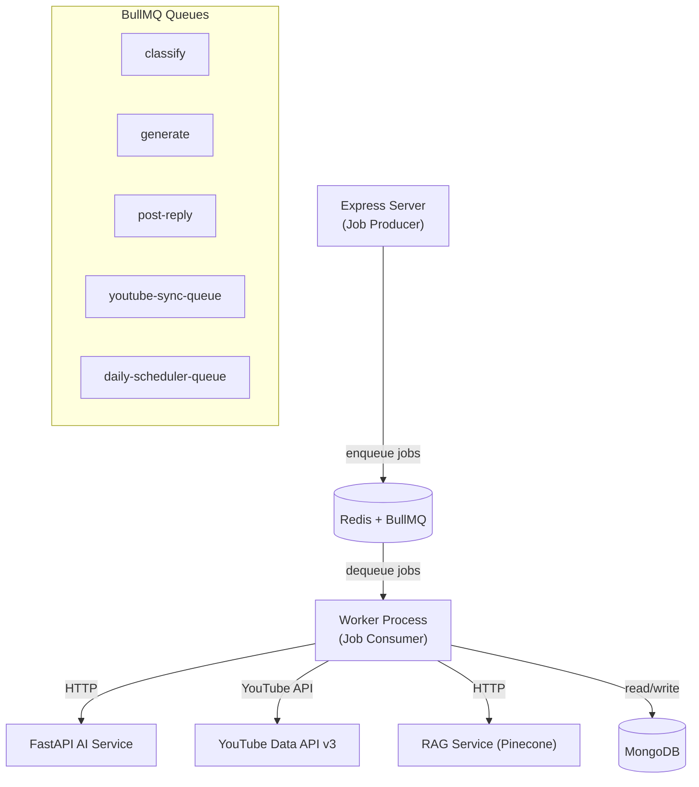
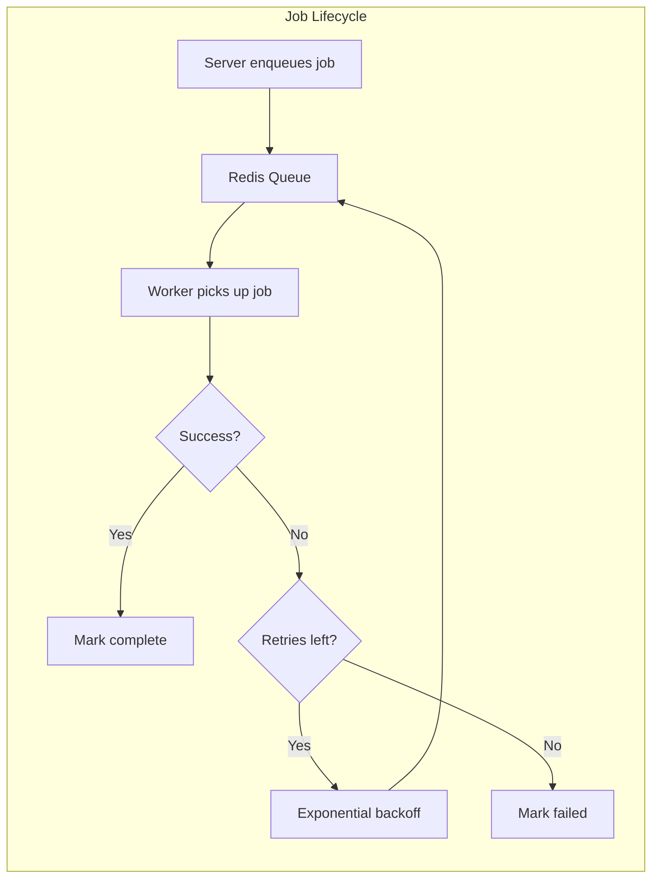
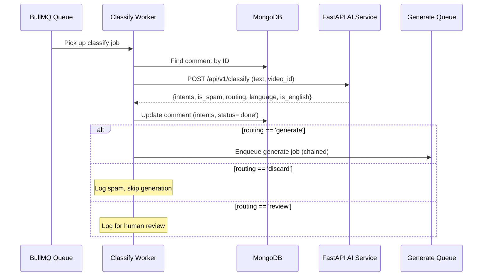
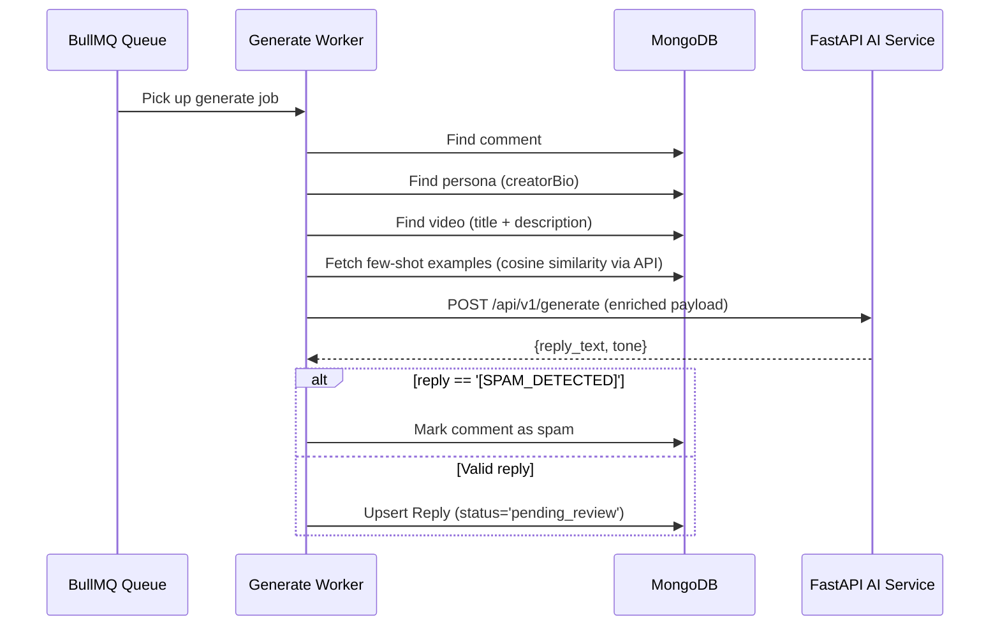
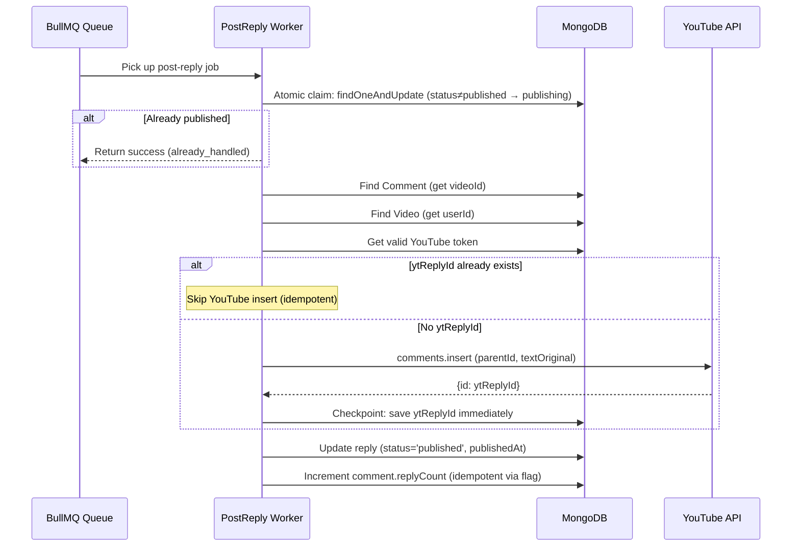
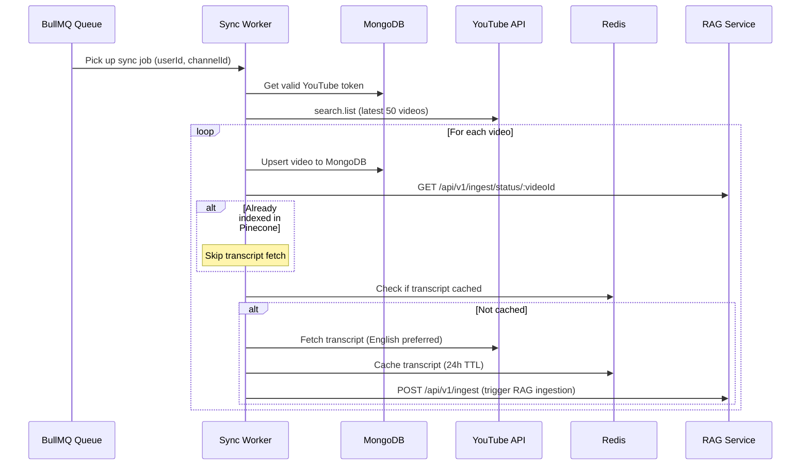
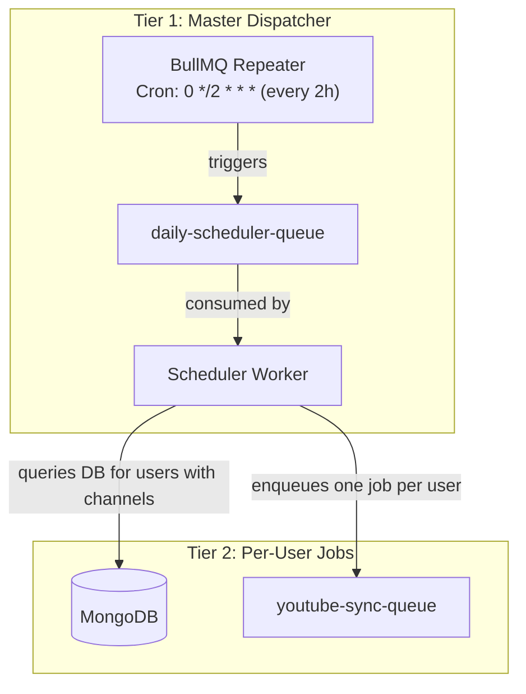
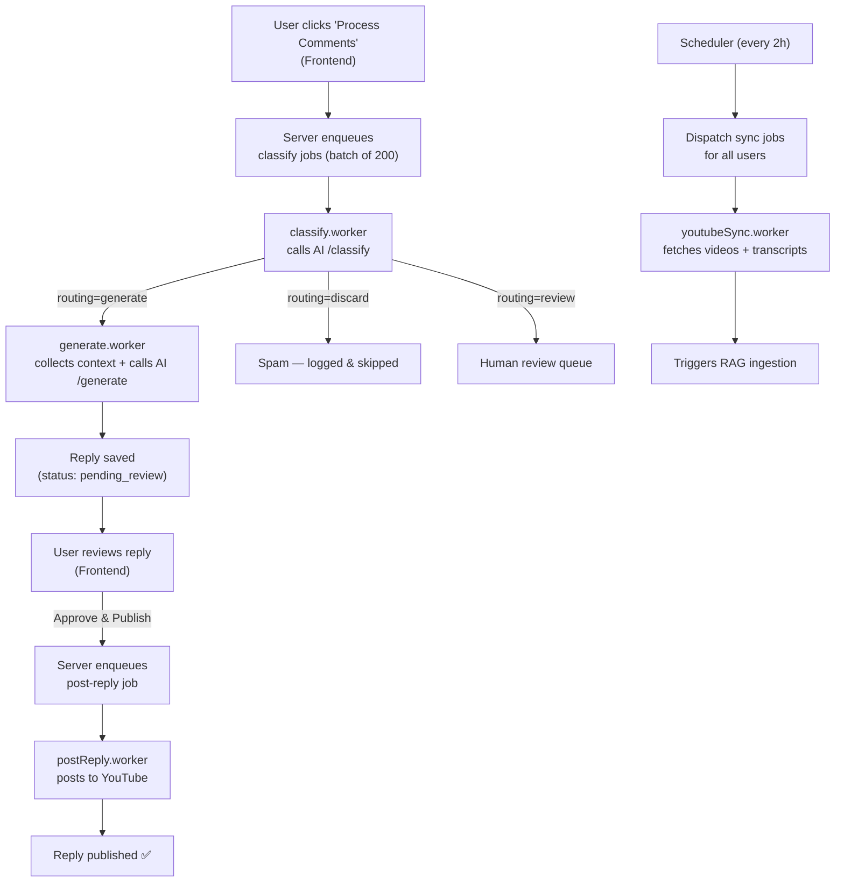

# ReplyPilot Worker — Detailed Architecture Report


---

## 1. What Is the Worker?

The **worker** is a **standalone, headless Node.js process** that runs alongside the server. It consumes jobs from **BullMQ queues** backed by Redis and performs **long-running, CPU/network-intensive tasks** asynchronously — keeping the server's HTTP response times fast.

**Why a separate process?** AI classification, reply generation, and YouTube API calls can take seconds to complete. Running them inline in Express request handlers would block the event loop, cause timeouts, and degrade user experience. The worker decouples these heavy tasks via a producer-consumer pattern.



---

## 2. Directory Structure — What & Why

```
worker/
├── main.js                       # Entry point — bootstrap, retry loop, graceful shutdown
├── package.json                  # Dependencies & scripts
├── config/                       # Centralized configuration (mirrors server)
│   ├── env.js                    # Zod-validated environment variables
│   ├── db.js                     # MongoDB connection (Mongoose)
│   └── redis.js                  # Dual Redis clients (node-redis + ioredis)
├── tasks/                        # BullMQ worker definitions (job processors)
│   ├── index.js                  # Worker registry + global event handlers
│   ├── classify.worker.js        # AI comment classification consumer
│   ├── generate.worker.js        # AI reply generation consumer
│   ├── postReply.worker.js       # YouTube reply publishing consumer
│   ├── youtubeSync.worker.js     # Channel video + transcript sync consumer
│   └── scheduler.js              # Recurring job dispatcher (cron-like)
├── models/                       # Mongoose schemas (shared with server)
│   ├── Comment.models.js         # Comments with intent classification
│   ├── Reply.models.js           # AI-generated replies (+ replyCountCredited)
│   ├── Persona.models.js         # Creator persona profiles
│   ├── PersonaExample.models.js  # Few-shot examples per persona
│   ├── User.models.js            # Google OAuth user profile
│   └── Video.models.js           # Video details + statistics
└── utils/                        # Shared utilities
    ├── httpClient.js             # Axios client for AI Service (30s timeout)
    ├── logger.js                 # Winston logger (worker-prefixed logs)
    ├── queueHelpers.js           # Generate queue + enqueue helper
    ├── youtubeClient.js          # YouTube API client + transcript fetcher
    └── youtubeToken.helper.js    # OAuth token refresh with race protection
```

---

## 3. Architecture Pattern — Event-Driven Job Consumer

The worker follows the **Consumer pattern** from the BullMQ framework:



| Design Choice | Implementation | Why |
|---------------|---------------|-----|
| **Separate process** | [main.js](file:///home/ashutosh/MAIN/ASHUTOSH%20PD/ReplyPilot/worker/main.js) runs independently from [server.js](file:///home/ashutosh/MAIN/ASHUTOSH%20PD/ReplyPilot/server/server.js) | Crash isolation — worker failures don't take down HTTP API |
| **BullMQ** | Redis-backed persistent queues | At-least-once delivery, retries, job chaining, cron repeaters |
| **5 concurrency** | Each worker processes up to 5 jobs in parallel | Balance between throughput and resource consumption |
| **3 retry attempts** | Exponential backoff starting at 5s | Handles transient AI service/network failures |
| **Job chaining** | Classify → automatically enqueues Generate | Pipeline pattern for multi-step processing |
| **Idempotent operations** | `replyCountCredited` flag, `ytReplyId` checkpoint | Safe retries — duplicate posts and double-counting are prevented |

---

## 4. Deep Dive — Each Component

### 4.1 Entry Point: [main.js](file:///home/ashutosh/MAIN/ASHUTOSH%20PD/ReplyPilot/worker/main.js)

**What**: Bootstraps the worker with the same exponential-backoff retry pattern as the server.

**Startup sequence**:
1. Connect to MongoDB ([connectdb()](file:///home/ashutosh/MAIN/ASHUTOSH%20PD/ReplyPilot/server/src/config/db.js#13-25))
2. Initialize the recurring scheduler ([initScheduler()](file:///home/ashutosh/MAIN/ASHUTOSH%20PD/ReplyPilot/worker/tasks/scheduler.js#50-75))  
3. Workers auto-register on import from [tasks/index.js](file:///home/ashutosh/MAIN/ASHUTOSH%20PD/ReplyPilot/worker/tasks/index.js)

**Graceful shutdown** (`SIGTERM`/`SIGINT`):
1. Close all 5 BullMQ workers (stops accepting new jobs, finishes in-progress ones)
2. Disconnect MongoDB
3. Exit process

**Why retry loop?** In container environments (Railway, Docker), the worker may start before MongoDB or Redis are ready. The retry loop prevents crash loops with delays of 5s → 10s → 20s → … → 60s (capped).

---

### 4.2 Worker Registry: [tasks/index.js](file:///home/ashutosh/MAIN/ASHUTOSH%20PD/ReplyPilot/worker/tasks/index.js)

**What**: Imports all 4 workers, attaches global event listeners, and exports them as an array.

**Event listeners registered**:
- `completed` → debug log
- `failed` → error log with job ID
- `error` → error log for process-level errors

**Why centralized?** Single place to add cross-cutting concerns (monitoring, metrics, alerts) to all workers.

---

### 4.3 Task Workers — The Core Processing Pipeline

#### [classify.worker.js](file:///home/ashutosh/MAIN/ASHUTOSH%20PD/ReplyPilot/worker/tasks/classify.worker.js) — AI Comment Classification

**Queue**: [classify](file:///home/ashutosh/MAIN/ASHUTOSH%20PD/ReplyPilot/server/src/services/aiService.js#13-26) (concurrency: 5)

**What it does**:



**Key design decisions**:
- **Job chaining**: If the AI routing decision is `"generate"`, the classify worker **automatically enqueues a generate job** — creating a seamless classify → generate pipeline without server intervention
- **Three routing paths**: [generate](file:///home/ashutosh/MAIN/ASHUTOSH%20PD/ReplyPilot/server/src/services/replyService.js#6-48) (auto-reply), `discard` (spam), `review` (human escalation for criticism)
- **Failure handling**: On error, marks the comment's `classificationStatus` as `'failed'` then re-throws for BullMQ retry

**Job data shape**:
```json
{
  "commentId": "MongoDB ObjectId",
  "tone": "friendly",
  "personaId": "ObjectId or null",
  "videoId": "YouTube video ID"
}
```

---

#### [generate.worker.js](file:///home/ashutosh/MAIN/ASHUTOSH%20PD/ReplyPilot/worker/tasks/generate.worker.js) — AI Reply Generation

**Queue**: [generate](file:///home/ashutosh/MAIN/ASHUTOSH%20PD/ReplyPilot/server/src/services/replyService.js#6-48) (concurrency: 5)

**What it does**:



**Key design decisions**:
- **Context enrichment**: Collects video context (title, description capped at 500 chars), persona bio, and few-shot examples before calling the AI
- **Few-shot examples via API**: Calls `POST /api/personas/:personaId/similar-examples` with the intent score vector for cosine similarity matching against `PersonaExample` documents
- **Spam sentinel**: If the AI returns `[SPAM_DETECTED]` (non-English spam caught by Gemma), marks the comment as spam instead of saving a reply
- **Failure rollback**: If a reply was created but subsequent logic fails, marks the reply status as `'failed'`

**Job data shape** (enriched from classify worker):
```json
{
  "commentId": "ObjectId",
  "tone": "friendly",
  "personaId": "ObjectId or null",
  "videoId": "video ID",
  "language": "en",
  "isEnglish": true,
  "intents": [{"label": "question", "confidence": 0.9}]
}
```

---

#### [postReply.worker.js](file:///home/ashutosh/MAIN/ASHUTOSH%20PD/ReplyPilot/worker/tasks/postReply.worker.js) — YouTube Reply Publishing

**Queue**: `post-reply` (concurrency: 5)

**What it does**:



**Key design decisions**:

| Pattern | Implementation | Why |
|---------|---------------|-----|
| **Atomic claim** | `findOneAndUpdate({status: {$ne: 'published'}}, {status: 'publishing'})` | Prevents duplicate workers from processing the same reply |
| **YouTube ID checkpoint** | Saves `ytReplyId` immediately after YouTube insert, before updating status | If the worker crashes after posting but before marking as `published`, retries won't double-post |
| **Idempotent reply counting** | `replyCountCredited` boolean flag; `updateOne` with `{$ne: true}` guard | Prevents incrementing `comment.replyCount` multiple times across retries |
| **Rollback on failure** | Only marks as `'failed'` if YouTube post didn't succeed | Avoids losing track of successfully posted replies |

This is the **most carefully engineered worker** because it has **real-world side effects** (posting to YouTube) that cannot be easily undone.

---

#### [youtubeSync.worker.js](file:///home/ashutosh/MAIN/ASHUTOSH%20PD/ReplyPilot/worker/tasks/youtubeSync.worker.js) — Video & Transcript Sync

**Queue**: `youtube-sync-queue` (concurrency: default)

**What it does**:



**Key design decisions**:
- **Transcript fetching**: Uses the `youtube-transcript` library to extract video transcripts, preferring English (`lang: 'en'`) with fallback to the original language
- **Pinecone deduplication**: Checks RAG index status before fetching transcripts — avoids redundant processing for already-indexed videos
- **Redis transcript cache**: 24-hour TTL (`86400s`) prevents re-fetching within the same day
- **RAG ingestion trigger**: After caching a new transcript, sends it to the RAG service's `/api/v1/ingest` endpoint for chunking, embedding, and Pinecone storage
- **Auth failure tolerance**: `invalid_grant` and revoked token errors are handled gracefully — the user is skipped (not crashed), logged as needing re-auth

**Job data shape**:
```json
{
  "userId": "MongoDB ObjectId (string)",
  "channelId": "YouTube channel ID"
}
```

---

### 4.4 Scheduler: [tasks/scheduler.js](file:///home/ashutosh/MAIN/ASHUTOSH%20PD/ReplyPilot/worker/tasks/scheduler.js)

**What**: A two-tier scheduling system using BullMQ repeatable jobs:



**Why two tiers?**
- A single cron repeater doesn't know which users exist at schedule time
- The master dispatcher queries MongoDB for all users with connected YouTube channels, then enqueues individual sync jobs per user
- This scales naturally — adding users requires zero scheduler changes

**Schedule**: Every 2 hours (`0 */2 * * *`) + one immediate run on startup.

---

### 4.5 Configuration Layer (`config/`)

The worker's config closely mirrors the server's, with key differences:

| Config | Difference from Server |
|--------|----------------------|
| **env.js** | Additionally validates `RAG_SERVICE_URL` (default: `http://localhost:8001`) |
| **db.js** | Identical — same Mongoose connection pool (2–10) with reconnect handlers |
| **redis.js** | Nearly identical but also exports a [ytTranscript](file:///home/ashutosh/MAIN/ASHUTOSH%20PD/ReplyPilot/worker/config/redis.js#57-58) key factory for transcript caching |

**Extra Redis key (worker only)**:
```javascript
ytTranscript: (videoId) => `transcript:${videoId}`   // 24h TTL
```

---

### 4.6 Models Layer — Differences from Server

The worker shares the same MongoDB database as the server but has its own model copies. Key differences:

| Model | Worker Difference |
|-------|-------------------|
| **Reply.models.js** | Includes `replyCountCredited: {type: Boolean, default: false}` — idempotency flag for reply count incrementing |
| **Persona.models.js** | Includes `tone` enum and `vocabulary`/`examples` fields (server's version has these commented out) |
| **PersonaExample.models.js** | **Worker-only model** — stores few-shot examples scoped to personas (vs. server's `VideoExample` scoped to videos) |
| **User.models.js** | `refreshToken` does NOT have `select: false` — worker needs to read refresh tokens directly for background sync |

---

### 4.7 Utilities

| Utility | What | Key Difference from Server |
|---------|------|---------------------------|
| **httpClient.js** | Axios client pre-configured for AI Service | 30s timeout; response error interceptor logs URL, status, data |
| **logger.js** | Winston with daily rotation | Log files prefixed `worker-` (vs `app-`); service meta: `replypilot-worker` |
| **queueHelpers.js** | Queue definition + [enqueueGenerateJob()](file:///home/ashutosh/MAIN/ASHUTOSH%20PD/ReplyPilot/worker/utils/queueHelpers.js#20-25) | Used by classify worker to chain jobs; 3 retries, exponential backoff |
| **youtubeClient.js** | YouTube API client + transcript fetcher | **Extra functions**: [fetchLatestVideos()](file:///home/ashutosh/MAIN/ASHUTOSH%20PD/ReplyPilot/worker/utils/youtubeClient.js#22-53) (search.list) and [fetchTranscript()](file:///home/ashutosh/MAIN/ASHUTOSH%20PD/ReplyPilot/worker/utils/youtubeClient.js#54-85) (youtube-transcript library, English-preferred) |
| **youtubeToken.helper.js** | OAuth token refresh with race protection | Enhanced error handling: catches `invalid_grant` specifically and flags `reAuthNeeded` for graceful skipping |

---

## 5. Job Pipeline — End-to-End Data Flow

The complete pipeline from user action to YouTube reply:



---

## 6. Graphify Analysis — Worker in the Knowledge Graph

From the [GRAPH_REPORT.md](file:///home/ashutosh/MAIN/ASHUTOSH%20PD/ReplyPilot/graphify-out/GRAPH_REPORT.md), the worker maps to these key communities:

| Community | Cohesion | Key Insight |
|-----------|----------|-------------|
| **Worker Queue Tasks** (#6) | 0.09 | 19 nodes — classify, generate, routing logic. Medium cohesion reflects the pipeline nature |
| **Queue Consumer** (#10) | 0.24 | 6 nodes — `QueueConsumer`, `_handle_signal()`, `_main()`. High cohesion — well-encapsulated consumer lifecycle |

**Thin communities (all worker files)**:
- [classify.worker.js](file:///home/ashutosh/MAIN/ASHUTOSH%20PD/ReplyPilot/worker/tasks/classify.worker.js) (#91), [generate.worker.js](file:///home/ashutosh/MAIN/ASHUTOSH%20PD/ReplyPilot/worker/tasks/generate.worker.js) (#44), [postReply.worker.js](file:///home/ashutosh/MAIN/ASHUTOSH%20PD/ReplyPilot/worker/tasks/postReply.worker.js) (#88), [youtubeSync.worker.js](file:///home/ashutosh/MAIN/ASHUTOSH%20PD/ReplyPilot/worker/tasks/youtubeSync.worker.js) (#89)
- Each appears as an isolated community because graphify treats them as entry points with few internal cross-references

**Bridge nodes connecting worker to other systems**:
- [fetchFewShotExamples()](file:///home/ashutosh/MAIN/ASHUTOSH%20PD/ReplyPilot/server/src/controllers/reply.controller.js#18-125) — bridges worker ↔ server (API call)  
- [enqueueGenerateJob()](file:///home/ashutosh/MAIN/ASHUTOSH%20PD/ReplyPilot/worker/utils/queueHelpers.js#20-25) — bridges classify ↔ generate (job chain)

---

## 7. Reliability & Fault Tolerance

| Concern | Solution | Implementation |
|---------|----------|----------------|
| **Double-posting to YouTube** | `ytReplyId` checkpoint + atomic claim | Save YouTube reply ID before marking as published |
| **Double-counting replies** | `replyCountCredited` flag | `updateOne` with `{$ne: true}` guard |
| **Race conditions (token refresh)** | In-memory promise deduplication | `ongoingRefreshPromises` Map prevents parallel refresh calls |
| **AI Service downtime** | BullMQ retries (3 attempts, exponential backoff) | 5s → 10s → 20s retry delays |
| **Stale jobs after crash** | BullMQ's built-in stalled-job detection | Jobs stuck in `active` are automatically retried |
| **YouTube auth failures** | `reAuthNeeded` flag on errors | Worker skips user gracefully, logs warning |
| **Worker crash** | Process manager (Docker, Railway) restarts | [main.js](file:///home/ashutosh/MAIN/ASHUTOSH%20PD/ReplyPilot/worker/main.js) retry loop handles transient start failures |
| **Database disconnection** | Mongoose reconnect events | Auto-reconnect with logging |

---

## 8. Worker vs. Server — Comparison

| Aspect | Server | Worker |
|--------|--------|--------|
| **Role** | HTTP API, job producer | Job consumer, background processor |
| **Framework** | Express 5 | BullMQ Workers |
| **Network facing** | Yes (public API) | No (internal only) |
| **Concurrency** | Single-threaded event loop | 5 concurrent jobs per queue |
| **YouTube writing** | No (enqueues publish jobs) | Yes (`comments.insert`) |
| **AI Service calls** | Sync (in request cycle) | Async (background jobs) |
| **Transcript handling** | Not handled | Fetches, caches, triggers RAG ingestion |
| **Session/Auth** | Passport + Redis sessions | Direct Redis token lookup |
| **Unique models** | `VideoExample` | `PersonaExample` |
| **Extra env vars** | `TOKEN_ENCRYPTION_KEY`, `SESSION_SECRET ≥32` | `RAG_SERVICE_URL` |

---

## 9. Dependencies & Tech Stack

| Package | Version | Purpose |
|---------|---------|---------|
| **bullmq** | 5.71.0 | Job queue framework (consumer side) |
| **mongoose** | 9.3.1 | MongoDB ODM |
| **ioredis** | 5.10.1 | Redis client for BullMQ |
| **redis** | 5.11.0 | Redis client for token cache + transcript cache |
| **axios** | 1.13.6 | HTTP client for AI Service + RAG Service |
| **googleapis** | 171.4.0 | YouTube Data API v3 client |
| **youtube-transcript** | 1.3.0 | YouTube transcript extraction |
| **winston** | 3.19.0 | Structured logging |
| **winston-daily-rotate-file** | 5.0.0 | Log file rotation (14-day general, 30-day errors) |
| **zod** | 4.3.6 | Runtime environment validation |
| **dotenv** | 17.3.1 | [.env](file:///home/ashutosh/MAIN/ASHUTOSH%20PD/ReplyPilot/worker/.env) file loading |
| **nodemon** | 3.1.14 | Dev-mode auto-restart (devDep) |